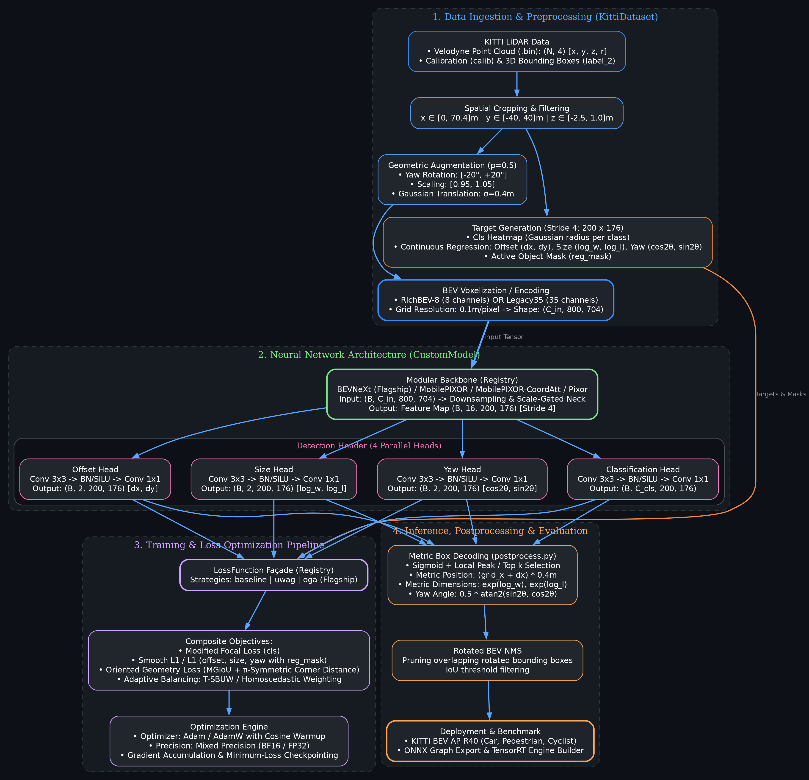
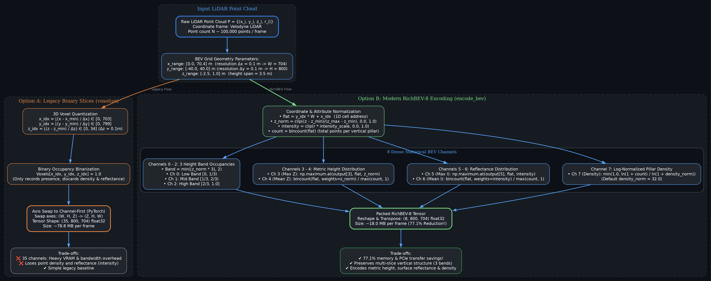
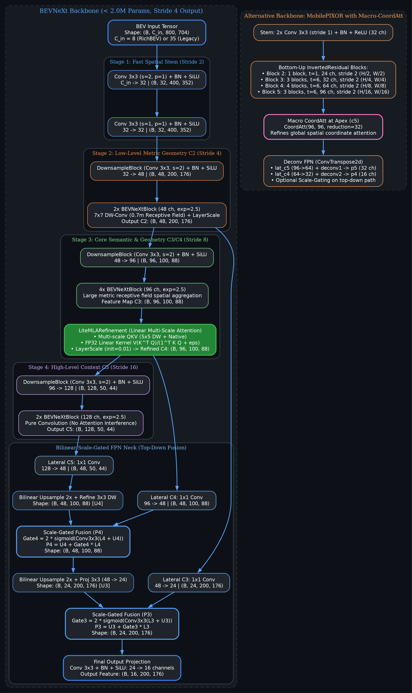
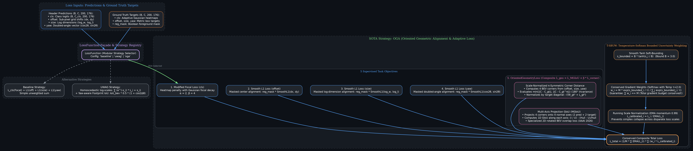
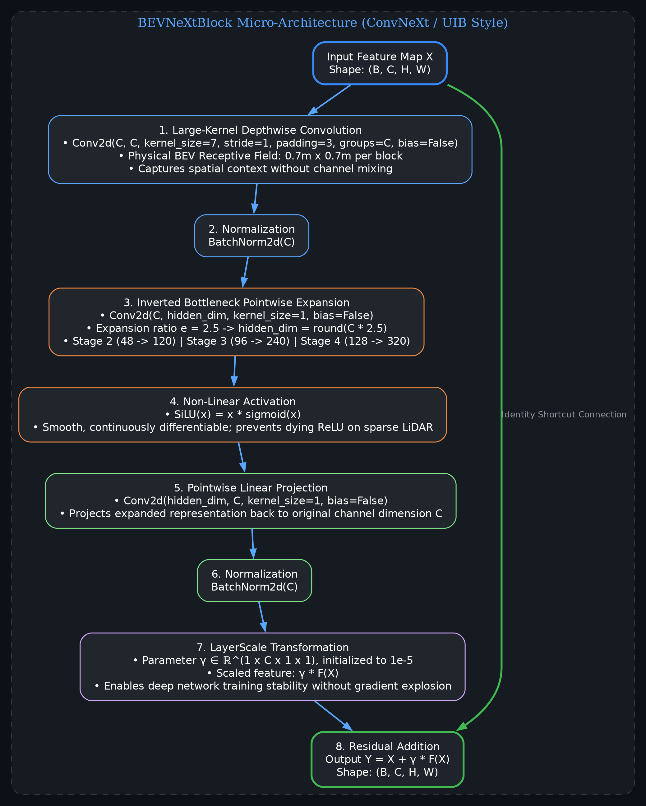
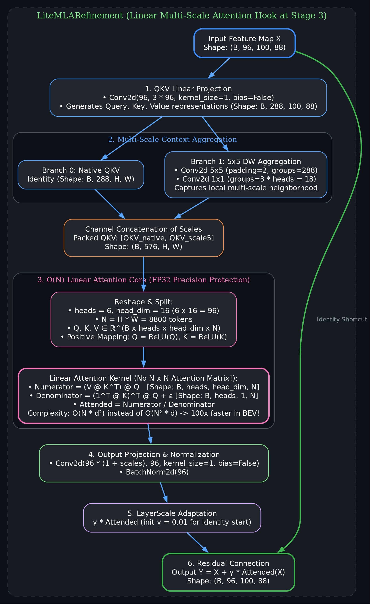
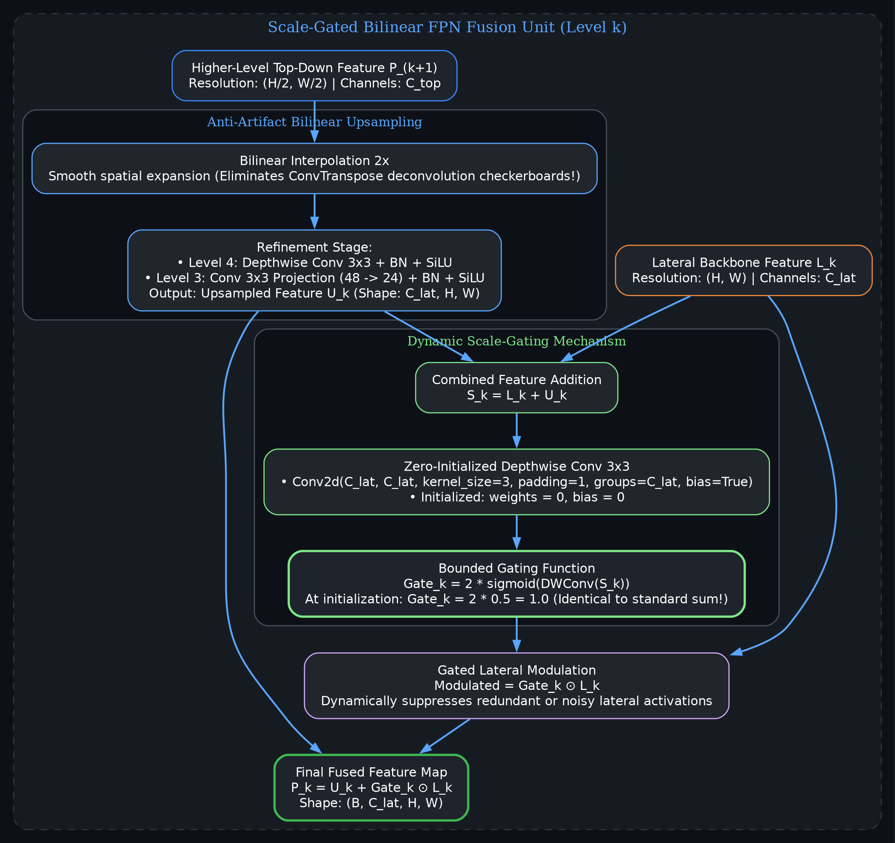
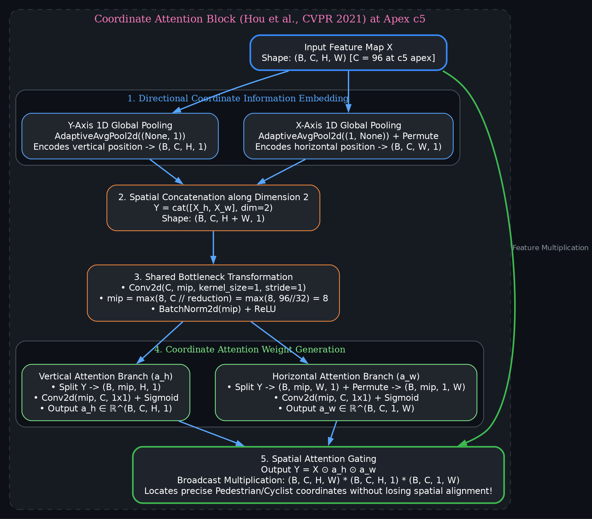
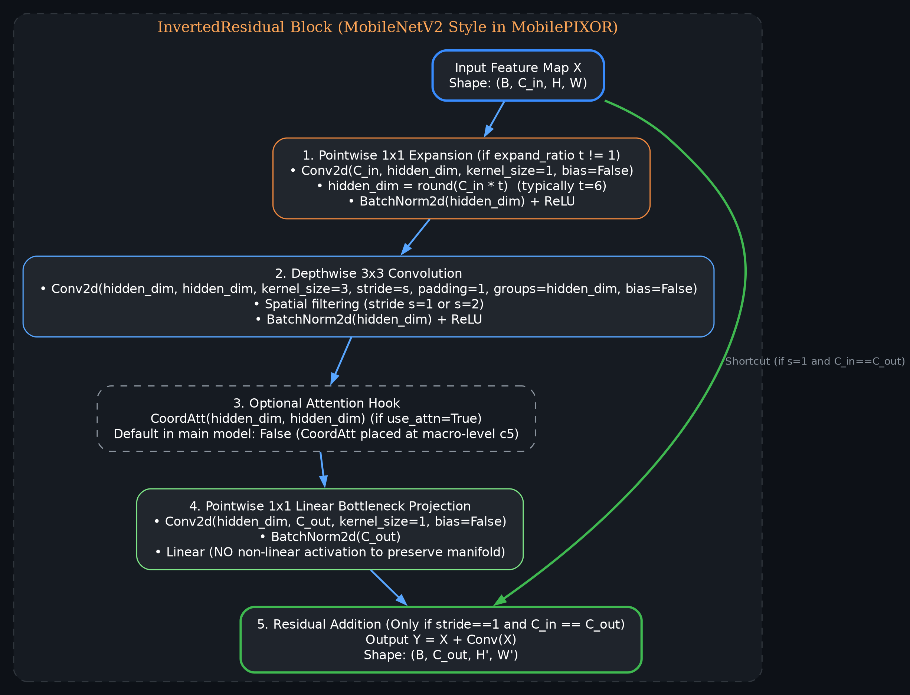

# Kiến Trúc Toàn Diện Hệ Thống 3D LiDAR Object Detection (BEVNeXt & MobilePIXOR)

Thư mục này chứa toàn bộ các biểu đồ kiến trúc hệ thống (`.png` và `.dot` nguồn) cùng giải thích chi tiết về luồng hoạt động, cấu trúc tensor, phương trình toán học và mã nguồn tương ứng trong repository.

---

## Danh Mục Biểu Đồ

| Số hiệu | Tên Biểu Đồ | File PNG | Mục tiêu & Nội dung chính |
|:---:|:---|:---|:---|
| **Hình 1** | **Tổng quát Codebase** | [`01_codebase_overview.png`](./01_codebase_overview.png) | Toàn cảnh End-to-End Pipeline: Dữ liệu KITTI $\to$ Tiền xử lý $\to$ Mô hình $\to$ Huấn luyện (Loss) $\to$ Suy luận (NMS) |
| **Hình 2** | **Chi tiết BEV Encoding** | [`02_bev_encoding_detail.png`](./02_bev_encoding_detail.png) | So sánh chi tiết 2 phương pháp: Legacy 35 Binary Slices vs RichBEV-8 (8 kênh đặc trưng thống kê) |
| **Hình 3** | **Chi tiết Backbone** | [`03_backbone_architecture.png`](./03_backbone_architecture.png) | Cấu trúc phân tầng BEVNeXt (Stem $\to$ Stage 2-4 $\to$ Scale-Gated FPN) và MobilePIXOR-CoordAtt |
| **Hình 4** | **Chi tiết Hệ thống Loss** | [`04_loss_system.png`](./04_loss_system.png) | LossFunction Façade & Chiến lược SOTA OGA (Focal + Smooth L1 + MGIoU + $\pi$-Corner Dist + T-SBUW) |
| **Hình 5** | **Khối `BEVNeXtBlock`** | [`05_block_bevnext.png`](./05_block_bevnext.png) | Khối tích chập 7x7 Depthwise Conv, 2.5x Inverted Expansion, SiLU và LayerScale |
| **Hình 6** | **Khối `LiteMLARefinement`** | [`06_block_litemla.png`](./06_block_litemla.png) | Khối Linear Attention đa tỉ lệ $O(N)$ tại Stage 3 với cơ chế tính FP32 chống tràn số |
| **Hình 7** | **Khối `ScaleGatedFPNBlock`** | [`07_block_scale_gated_fpn.png`](./07_block_scale_gated_fpn.png) | Cổng học tỉ lệ (Scale-Gated) kết hợp Bilinear Upsampling chống hiện tượng bàn cờ (checkerboard) |
| **Hình 8** | **Khối `CoordAtt`** | [`08_block_coordatt.png`](./08_block_coordatt.png) | Khối Coordinate Attention tại đỉnh kim tự tháp C5 (Hour et al. CVPR 2021) phân rã tọa độ X/Y |
| **Hình 9** | **Khối `InvertedResidual`** | [`09_block_inverted_residual.png`](./09_block_inverted_residual.png) | Khối Inverted Residual chuẩn MobileNetV2 sử dụng trong MobilePIXOR |

---

## 1. Hình 1: Tổng Quát Codebase (End-to-End Pipeline)



### Luồng Hoạt Động Chi Tiết
1. **Dữ liệu đầu vào (KITTI Dataset)**:
   - Point Cloud Velodyne `.bin`: chứa tọa độ không gian $(x, y, z)$ và độ phản xạ (reflectance / intensity $r$).
   - Nhãn bounding box 3D mặt đất (`label_2`) và ma trận hiệu chuẩn camera-LiDAR (`calib`).
2. **Tiền xử lý & Tạo Target ([`KittiDataset`](file:///home/duyennh/AI_projects/research_lidar/Lidar/detector/core/datasets/dataset.py)):**
   - Lọc không gian theo phạm vi xe: $x \in [0, 70.4]\text{m}$, $y \in [-40, 40]\text{m}$, $z \in [-2.5, 1.0]\text{m}$.
   - Tăng cường hình học (Geometric Augmentation): Xoay góc yaw $\pm 20^\circ$, co giãn ngẫu nhiên $[0.95, 1.05]$, dịch chuyển Gaussian $\sigma = 0.4\text{m}$.
   - Mã hóa BEV (BEV Encoding): Biến đổi đám mây điểm thành Tensor 2D lưới BEV kích thước $(C_{in}, 800, 704)$ với độ phân giải $0.1\text{m/pixel}$.
   - Sinh Target ([`target_backend.py`](file:///home/duyennh/AI_projects/research_lidar/Lidar/detector/core/datasets/utils_1/target_backend.py)):
     * Heatmap phân loại Gaussian kích thước $(B, C_{cls}, 200, 176)$ với stride 4 ($0.4\text{m/cell}$).
     * Nhãn hồi quy liên tục: Offset tâm lưới $(dx, dy)$, kích thước log $(\ln w, \ln l)$, góc hướng kép $(\cos 2\theta, \sin 2\theta)$.
     * Mặt nạ đối tượng dương tính `reg_mask` $(B, 200, 176)$.
3. **Mạng nơ-ron ([`CustomModel`](file:///home/duyennh/AI_projects/research_lidar/Lidar/detector/core/models/model.py)):**
   - **Backbone**: Trích xuất đặc trưng đa tầng giảm chiều từ $800\times 704$ về Stride 4 ($200\times 176$), kênh đầu ra 16.
   - **Detection Header ([`Header`](file:///home/duyennh/AI_projects/research_lidar/Lidar/detector/core/models/heads/cnn.py)):** 4 nhánh tích chập độc lập dự đoán song song `cls`, `offset`, `size`, `yaw`.
4. **Huấn luyện & Tối ưu hóa:**
   - Sử dụng `LossFunction` Façade kết hợp chiến lược `oga` (Oriented Geometric Alignment) hoặc `uwag`.
   - Trình tối ưu: Adam/AdamW với Cosine Annealing Warmup, mixed precision BF16, tích lũy gradient (gradient accumulation).
5. **Suy luận & Đánh giá ([`postprocess.py`](file:///home/duyennh/AI_projects/research_lidar/Lidar/detector/postprocess.py)):**
   - Sigmoid + Lọc đỉnh cục bộ (Peak extraction) theo ngưỡng xác suất class.
   - Giải mã tọa độ thực $(x, y, w, l, \theta)$.
   - Áp dụng Rotated BEV NMS loại bỏ các hộp trùng lặp.
   - Đánh giá theo chuẩn KITTI BEV AP R40 và hỗ trợ xuất mô hình sang ONNX / TensorRT.

---

## 2. Hình 2: Chi Tiết BEV Encoding (Legacy35 vs RichBEV-8)



Hệ thống hỗ trợ 2 cơ chế voxel hóa / mã hóa đám mây điểm LiDAR nhìn từ trên xuống (Bird's Eye View):

### 2.1. Legacy Binary Slices (`voxelize`)
- Chia trục độ cao $z$ thành 35 lát đều nhau ($\Delta z = 0.1\text{m}$, từ $-2.5\text{m}$ đến $+1.0\text{m}$).
- Mỗi voxel được gán giá trị nhị phân $\{0, 1\}$ nếu có ít nhất 1 điểm rơi vào.
- **Hạn chế**: Chiếm tới 35 kênh ($\sim 78.8\text{ MB/frame}$), gây nghẽn băng thông PCIe/VRAM, hoàn toàn làm mất thông tin cường độ phản xạ và mật độ điểm.

### 2.2. RichBEV-8 Encoding (`encode_bev`)
Nén dữ liệu xuống **8 kênh thống kê liên tục** ($\sim 18.0\text{ MB/frame}$, giảm $77.1\%$ dung lượng):
- **Kênh 0 – 2 (3 Dải độ cao - Height Bands)**:
  - Chuẩn hóa: $z_{norm} = \text{clip}\left(\frac{z - z_{min}}{z_{max} - z_{min}}, 0, 1\right)$
  - $\text{Ch } 0$: Tồn tại điểm trong dải thấp $[0, 1/3)$
  - $\text{Ch } 1$: Tồn tại điểm trong dải giữa $[1/3, 2/3)$
  - $\text{Ch } 2$: Tồn tại điểm trong dải cao $[2/3, 1.0]$
- **Kênh 3 (Độ cao tương đối cực đại - Max Z)**: $\max_{p \in \text{pillar}} z_{norm}$
- **Kênh 4 (Độ cao tương đối trung bình - Mean Z)**: $\frac{1}{N_{pts}} \sum_{p \in \text{pillar}} z_{norm}$
- **Kênh 5 (Độ phản xạ cực đại - Max Intensity)**: $\max_{p \in \text{pillar}} (\text{clip}(r \cdot \text{scale}, 0, 1))$
- **Kênh 6 (Độ phản xạ trung bình - Mean Intensity)**: $\frac{1}{N_{pts}} \sum_{p \in \text{pillar}} (\text{clip}(r \cdot \text{scale}, 0, 1))$
- **Kênh 7 (Mật độ điểm chuẩn hóa Log - Normalized Density)**:
  $$\text{Ch } 7 = \min\left(1.0, \frac{\ln(1 + N_{pts})}{\ln(1 + N_{norm})}\right), \quad \text{với } N_{norm} = 32.0$$

---

## 3. Hình 3: Chi Tiết Kiến Trúc Backbone (BEVNeXt)



[`BEVNeXtBackbone`](file:///home/duyennh/AI_projects/research_lidar/Lidar/detector/core/models/backbones/bevnext.py) là backbone hiện đại được thiết kế riêng cho BEV LiDAR với dung lượng nhẹ (< 2.0M tham số):

1. **Stage 1 (Fast Spatial Stem - Stride 2)**:
   - Hai lớp Conv $3\times 3$ (stride 2 rồi stride 1) + BatchNorm2d + SiLU.
   - Đầu vào $(B, C_{in}, 800, 704) \to (B, 32, 400, 352)$.
2. **Stage 2 (C2 - Low-Level Metric Geometry - Stride 4)**:
   - `DownsampleBlock` ($3\times 3, s=2$): $32 \to 48$ kênh.
   - 2 khối `BEVNeXtBlock` (48 kênh, kernel $7\times 7$, expansion 2.5).
   - Xuất feature $C_2$: $(B, 48, 200, 176)$.
3. **Stage 3 (C3/C4 - Core Semantic & Geometry - Stride 8)**:
   - `DownsampleBlock` ($3\times 3, s=2$): $48 \to 96$ kênh.
   - 4 khối `BEVNeXtBlock` (96 kênh, dung lượng biểu diễn không gian lớn).
   - Khối tinh chỉnh chú ý tuyến tính `LiteMLARefinement` (Linear Multi-Scale Attention với head_dim=16, FP32).
   - Xuất feature $C_4$: $(B, 96, 100, 88)$.
4. **Stage 4 (C5 - High-Level Context - Stride 16)**:
   - `DownsampleBlock` ($3\times 3, s=2$): $96 \to 128$ kênh.
   - 2 khối `BEVNeXtBlock` tích chập thuần (pure convolution, tránh hiện tượng cascading attention).
   - Xuất feature $C_5$: $(B, 128, 50, 44)$.
5. **Bilinear Scale-Gated FPN Neck (Top-Down Fusion)**:
   - Chiếu ngang (Lateral Projections): $L_5 (128 \to 48)$, $L_4 (96 \to 48)$, $L_3 (48 \to 24)$.
   - Thay thế hoàn toàn `ConvTranspose2d` bằng nội suy song tuyến (Bilinear 2x) + tinh chỉnh tích chập chiều sâu để loại bỏ triệt để hiện tượng bàn cờ (checkerboard artifacts).
   - Cổng học tỉ lệ (Scale-Gate) tự động điều chỉnh đóng góp của các tầng theo công thức:
     $$P_k = U_k + 2\sigma(\text{DWConv}_{3\times 3}(L_k + U_k)) \odot L_k$$
   - Tích chập đầu ra: Conv $3\times 3$ ($24 \to 16$ kênh) + BN + SiLU $\implies (B, 16, 200, 176)$ Stride 4.

---

## 4. Hình 4: Chi Tiết Hệ Thống Loss (Chiến Lược OGA)



[`LossFunction`](file:///home/duyennh/AI_projects/research_lidar/Lidar/detector/core/losses/loss_fn.py) hỗ trợ kiến trúc mô-đun hoá với 3 chiến lược: `baseline`, `uwag`, và `oga`.

Trong đó, [`OgaLossStrategy`](file:///home/duyennh/AI_projects/research_lidar/Lidar/detector/core/losses/strategies/oga.py) kết hợp giám sát kép đa mục tiêu:

### 4.1. 5 Mục Tiêu Thành Phần
1. $\mathcal{L}_{cls}$: **Modified Gaussian Focal Loss** trên heatmap phân loại.
2. $\mathcal{L}_{offset}$: **Smooth L1 Loss** có trọng số theo mặt nạ `reg_mask` trên tọa độ tâm $(dx, dy)$.
3. $\mathcal{L}_{size}$: **Smooth L1 Loss** trên kích thước log $(\ln w, \ln l)$.
4. $\mathcal{L}_{yaw}$: **Smooth L1 Loss** trên vector góc kép $(\cos 2\theta, \sin 2\theta)$.
5. $\mathcal{L}_{geo}$ ([`OrientedGeometryLoss`](file:///home/duyennh/AI_projects/research_lidar/Lidar/detector/core/losses/oriented_geometry_loss.py)):
   - **Khoảng cách góc $\pi$-đối xứng chuẩn hóa tỉ lệ (Scale-Normalized $\pi$-Symmetric Corner Distance)**:
     $$\mathcal{L}_{corner} = \frac{\min\left(\|C - C_{gt}\|, \|C - C_{gt}^\pi\|\right)}{\sqrt{W_{gt}^2 + L_{gt}^2}}$$
     Đảm bảo bất biến khi xoay $180^\circ$ và cân bằng độ nhạy giữa xe tải lớn và người đi bộ nhỏ.
   - **Multi-Axis Projection GIoU (MGIoU - AAAI 2026)**:
     Chiếu 4 đỉnh hộp xoay lên 4 trục pháp tuyến (2 trục của dự đoán và 2 trục của ground truth) để tính GIoU 1 chiều:
     $$\mathcal{L}_{MGIoU} = \frac{1 - \text{mean}(\text{GIoU}_{1D})}{2}$$
   - Tổng hợp hình học: $\mathcal{L}_{geo} = \mathcal{L}_{MGIoU} + \beta \mathcal{L}_{corner}$.

### 4.2. Cơ Chế Cân Bằng Trọng Số T-SBUW
[`TemperatureSoftmaxUncertainty`](file:///home/duyennh/AI_projects/research_lidar/Lidar/detector/core/losses/uncertainty_weighting.py) giải quyết triệt để vấn đề mất cân bằng gradient và sụp đổ simplex:
- **Giới hạn mềm Tanh (Soft Bounding)**: $s_i^{bounded} = B \cdot \tanh(s_i / B)$ với $B = 3.0$.
- **Bảo toàn tổng ngân sách Gradient qua Softmax nhiệt độ $\tau = 2.0$**:
  $$w_i = M \cdot \frac{\exp(s_i^{bounded} / \tau)}{\sum_{j=1}^M \exp(s_j^{bounded} / \tau)}, \quad \text{luôn đảm bảo } \sum_{i=1}^M w_i = M$$
- **Chuẩn hóa cân bằng thang mất mát qua EMA động (Momentum 0.99)**:
  $$L_i^{calib} = \frac{L_i}{\text{EMA}(L_i)}$$
- **Hàm mất mát tổng cộng**:
  $$\mathcal{L}_{total} = \left(\frac{1}{M}\sum_{i=1}^M \text{EMA}(L_i)\right) \sum_{i=1}^M w_i L_i^{calib}$$

---

## 5. Hình 5: Chi Tiết Khối `BEVNeXtBlock`



[`BEVNeXtBlock`](file:///home/duyennh/AI_projects/research_lidar/Lidar/detector/core/models/backbones/bevnext_blocks.py#L22-L76) được xây dựng theo phong cách ConvNeXt / Universal Inverted Bottleneck (UIB):
1. **Depthwise Conv $7\times 7$ (stride 1, padding 3, groups=$C$)**: Tạo trường tiếp nhận không gian vật lý lớn ngay lập tức ($0.7\text{m} \times 0.7\text{m}$ trên lưới BEV).
2. **BatchNorm2d**.
3. **Pointwise Conv $1\times 1$ Expansion**: Mở rộng số kênh lên $2.5\times C$ ($C \to 2.5C$).
4. **Hàm kích hoạt SiLU**: $\text{SiLU}(x) = x \cdot \sigma(x)$, mượt mà, tránh hiện tượng chết nơ-ron (dying ReLU) trên dữ liệu LiDAR thưa.
5. **Pointwise Conv $1\times 1$ Projection**: Chiếu ngược về $C$ kênh gốc.
6. **BatchNorm2d**.
7. **LayerScale**: Nhân trọng số vô hướng học được $\gamma \in \mathbb{R}^{1\times C\times 1\times 1}$ (khởi tạo $10^{-5}$) giúp huấn luyện ổn định khi mạng sâu.
8. **Residual Connection**: Cộng tắt $Y = X + \gamma \odot F(X)$.

---

## 6. Hình 6: Chi Tiết Khối `LiteMLARefinement`



[`LiteMLARefinement`](file:///home/duyennh/AI_projects/research_lidar/Lidar/detector/core/models/backbones/bevnext_blocks.py#L103-L190) là cơ chế chú ý tuyến tính đa tỉ lệ (Multi-Scale Linear Attention):
1. **Chiếu QKV**: Conv $1\times 1$ từ 96 kênh sang $3 \times 96 = 288$ kênh.
2. **Tập hợp đa tỉ lệ (Multi-Scale Context Aggregation)**:
   - Nhánh gốc (Native QKV).
   - Nhánh tích chập chiều sâu $5\times 5$ (padding 2, groups=288) kết hợp Conv $1\times 1$.
   - Ghép kênh (Concatenate) thành tensor 576 kênh.
3. **Linear Attention Core $O(N)$ (Độ chính xác FP32)**:
   - Phân rã thành 6 heads, head_dim = 16, $N = H \cdot W = 8800$ tokens.
   - Ánh xạ không âm: $Q \leftarrow \text{ReLU}(Q)$, $K \leftarrow \text{ReLU}(K)$.
   - Tính toán ma trận kết hợp:
     $$\text{Tử số} = V \cdot (K^T \cdot Q) \quad \in \mathbb{R}^{B \times h \times d \times N}$$
     $$\text{Mẫu số} = (\mathbf{1}^T \cdot K)^T \cdot Q + \epsilon \quad \in \mathbb{R}^{B \times h \times 1 \times N}$$
     $$\text{Attended} = \frac{\text{Tử số}}{\text{Mẫu số}}$$
   - **Ưu điểm**: Độ phức tạp chỉ $O(N \cdot d^2)$ thay vì $O(N^2 \cdot d)$, không cần tạo ma trận chú ý $8800 \times 8800$, giảm hàng chục lần bộ nhớ.
4. **Chiếu đầu ra & LayerScale**: Chiếu về 96 kênh + BatchNorm2d + LayerScale ($\gamma=0.01$) + Residual Add.

---

## 7. Hình 7: Chi Tiết Khối `ScaleGatedFPNBlock`



Khối tích hợp tỉ lệ thích ứng trong FPN ([`bevnext.py`](file:///home/duyennh/AI_projects/research_lidar/Lidar/detector/core/models/backbones/bevnext.py#L113-L170)):
1. **Nội suy song tuyến (Bilinear Interpolation 2x)**: Nâng độ phân giải từ mức trên mà không sinh hiệu ứng răng cưa bàn cờ.
2. **Tinh chỉnh**: Tích chập Depthwise $3\times 3$ hoặc Conv $3\times 3$ chiếu kênh tạo feature $U_k$.
3. **Cổng học tỉ lệ (Scale-Gating)**:
   - Cộng đặc trưng: $S_k = L_k + U_k$.
   - Tích chập Depthwise $3\times 3$ khởi tạo trọng số và bias bằng 0.
   - Hàm kích hoạt: $\text{Gate}_k = 2 \cdot \sigma(\text{DWConv}(S_k))$.
   - Khi khởi tạo: $\text{Gate}_k = 2 \cdot 0.5 = 1.0$, hoạt động hoàn hảo tương đương phép cộng FPN truyền thống trước khi học.
4. **Hòa trộn điều chế**: $P_k = U_k + \text{Gate}_k \odot L_k$.

---

## 8. Hình 8: Chi Tiết Khối `CoordAtt` (Coordinate Attention)



[`CoordAtt`](file:///home/duyennh/AI_projects/research_lidar/Lidar/detector/core/models/backbones/mobilepixor_coordinate_attention.py#L148-L213) (Hou et al., CVPR 2021) được đặt ở đỉnh kim tự tháp $C_5$ (96 kênh):
1. **Tập hợp thông tin 1 chiều**:
   - Pooling trục dọc Y: `AdaptiveAvgPool2d((None, 1))` $\implies (B, C, H, 1)$.
   - Pooling trục ngang X: `AdaptiveAvgPool2d((1, None))` $\implies (B, C, 1, W) \to (B, C, W, 1)$.
2. **Ghép kênh không gian**: Ghép dọc theo chiều không gian $Y = [X_h, X_w] \in \mathbb{R}^{B \times C \times (H+W) \times 1}$.
3. **Biến đổi nghẽn cổ chai chung (Shared Bottleneck)**:
   - Conv $1\times 1$ giảm số kênh xuống $\text{mip} = \max(8, C // 32) = 8$.
   - BatchNorm2d + ReLU (tránh nơ-ron chết).
4. **Tách nhánh & Sinh trọng số**:
   - Nhánh Y: Conv $1\times 1$ ($mip \to C$) + Sigmoid $\implies a_h \in \mathbb{R}^{B \times C \times H \times 1}$.
   - Nhánh X: Conv $1\times 1$ ($mip \to C$) + Sigmoid $\implies a_w \in \mathbb{R}^{B \times C \times 1 \times W}$.
5. **Điều chế hai chiều**:
   $$Y = X \odot a_h \odot a_w$$
   Giúp mô hình định vị chính xác vị trí không gian của Người đi bộ (Pedestrian) và Xe đạp (Cyclist) mà không bị mất mát tọa độ như Global Average Pooling chuẩn.

---

## 9. Hình 9: Chi Tiết Khối `InvertedResidual`



[`InvertedResidual`](file:///home/duyennh/AI_projects/research_lidar/Lidar/detector/core/models/backbones/mobilepixor_coordinate_attention.py#L218-L304) là khối chuẩn phong cách MobileNetV2 trong MobilePIXOR:
1. **Pointwise Expansion**: Conv $1\times 1$ mở rộng kênh $C_{in} \to t \cdot C_{in}$ ($t=6$) + BatchNorm2d + ReLU.
2. **Depthwise Conv $3\times 3$**: Lọc không gian với stride $s \in \{1, 2\}$, groups=$t C_{in}$ + BatchNorm2d + ReLU.
3. **Pointwise Linear Projection**: Conv $1\times 1$ chiếu về $C_{out}$ + BatchNorm2d (**không dùng hàm phi tuyến** để bảo toàn đa tạp đặc trưng).
4. **Residual Connection**: Cộng tắt $Y = X + \text{Conv}(X)$ khi và chỉ khi stride $s=1$ và $C_{in} == C_{out}$.

---

## Hướng Dẫn Tái Tạo Biểu Đồ

Để sinh lại toàn bộ các file `.dot` và `.png` từ terminal, chạy lệnh:

```bash
python3 tools/generate_diagrams.py
```
Toàn bộ hình ảnh sẽ được cập nhật đồng bộ với độ phân giải cao tại thư mục `diagrams/`.
