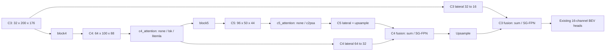

# C4 backbone ablations

## Config switches

All presets live in `configs/kitti/backbone_branch/`.

| Preset / Colab VARIANT | File | C4 attention | C5 attention | Legacy35 + sum-FPN parameters |
|---|---|---|---|---:|
| B0 | kitti_mobilepixor_baseline.json | none | none | 597,817 |
| B1_C2PSA | kitti_mobilepixor_c2psa.json | none | c2psa | 633,865 |
| C4_LSK | kitti_mobilepixor_c4_lsk.json | lsk | none | 617,663 |
| C4_LITEMLA | kitti_mobilepixor_c4_litemla.json | litemla | none | 626,361 |

The C4 presets each differ from B0 only in the selected C4 adapter, its options,
and the descriptive note. Augmentation remains enabled. Heads, loss, geometry,
optimizer, split, schedule, and default encoding/FPN are shared.

Set the independent switches in a config copy:

```json
{
  "model": {
    "backbone": "mobilepixor",
    "backbone_out_dim": 16,
    "cls_encoding": "gaussian",
    "c4_attention": "lsk",
    "c5_attention": "none",
    "scale_gated_fpn": false
  }
}
```

This fragment belongs inside a complete existing training config. C4 choices are
`none`, `lsk`, and `litemla`. C5 choices remain `none` and `c2psa`.
`data.bev_encoding.name` selects `binary_slices` (35 channels with this geometry)
or `rich8`. SG-FPN accepts a JSON Boolean. There is no automatic enabling of C2PSA,
SG-FPN, CoordAtt, UWAG, or a different encoding when C4 is enabled.

The complete switch space is 3 C4 choices x 2 C5 choices x 2 encodings x 2 FPN
choices = 24 configurations. Start with C5=`none` to isolate C4, then test C2PSA
interactions separately. Enabling C4 and C5 together is supported but is a distinct
experiment, not the default C4 preset.

With Rich8, all counts decrease by 7,776 (27 fewer input channels x 32 stem
channels x 3 x 3). SG-FPN adds 480. C2PSA adds 36,048 relative to C5=`none`.
The new adapters add 19,846 (LSK) and 28,544 (LiteMLA), independent of encoding/FPN.

## Placement and compatibility



Both consumers of C4 receive the same refined tensor. No feature resize or
target/decoder change is needed. `none` is parameter-free Identity: old B0/B1
state dicts load strictly and their parameter counts and outputs are preserved.
Enabling an adapter introduces new checkpoint keys; start a new training run.
Do not resume an old off-mode checkpoint into an on-mode experiment. To reproduce
an older Colab run, use its original checkout/config/metadata rather than disabling
the resume guard. New default run names include all architecture switches and a
config hash to keep ablations separate.

## What is implemented

These modules are adaptations of published mechanisms. They do not reproduce the
entire original LSKNet or EfficientViT block/backbone and do not establish novelty
or accuracy gains simply by being integrated here.

### LSKRefinement

BN -> pointwise projection -> GELU supplies features F. A depthwise 5x5 operation
produces U; a depthwise 7x7, dilation 3 operation on U produces V. Their effective
receptive fields are 5x5 and 23x23 at C4. Separate pointwise projections reduce
both to 32 channels. Channel mean/max summaries of their concatenation produce
two spatial sigmoid gates using a 7x7 convolution. These gates are independent,
not softmax-normalized and not scalar weights shared over the whole map.

The gated branch sum is projected to 64 channels, multiplies F, and passes through
an output pointwise projection. The result is added as `X + gamma * refinement`.
`gamma` is a learned per-channel LayerScale initialized to 0.01. This is near
identity, not exact identity. The large context branch spans a broad metric area;
its usefulness for sparse objects must be measured rather than assumed.

Compared with upstream: retain the spatial-selection mechanism, use a single
pre-normalized residual adapter with one LayerScale, and omit the additional MLP,
stochastic depth, and full backbone. Options: `model.lsk.layer_scale_init`.

### LiteMLARefinement

The native QKV projection and each locally aggregated QKV scale are treated as
separate groups of attention heads. Each scale uses a depthwise convolution and
grouped 1x1 mixing. Defaults are 4 heads of dimension 16 per scale, native plus
one 5x5 scale. For each group (channel-first layout):

```text
Q+ = ReLU(Q), K+ = ReLU(K)
output = ((V @ transpose(K+)) @ Q+) / (transpose(sum_positions(K+)) @ Q+ + eps)
```

There is no softmax and no spatial N x N attention matrix. At fixed head dimension,
attention scales linearly with spatial positions; channel-size intermediates are
computed first. The output is projected to 64 channels and batch-normalized, then
added through a learned LayerScale initialized to 0.01.

Compared with upstream: always use the linear formulation, accumulate numerator
and denominator in FP32 for both FP16 and BF16 input, use eps=1e-6, add LayerScale,
and omit the separate EfficientViT local MBConv/FFN. Existing MobilePIXOR blocks
continue to supply local processing. Options in `model.litemla`:

```json
{"head_dim": 16, "scales": [5], "eps": 0.000001, "layer_scale_init": 0.01}
```

`head_dim` must divide 64. Scale kernels must be distinct odd integers >=3;
`scales: []` is a native-scale-only ablation. These settings alter the experiment
and sometimes the state dict; record them through the full resolved config.

## Colab

Push these changes to `C2PSA_c5block` (or select the branch that contains them)
before running the notebook; a local edit is not available in Colab automatically.

```python
VARIANT = "C4_LSK"           # or "C4_LITEMLA"
BEV_ENCODING_OVERRIDE = "rich8"       # or "binary_slices"
SCALE_GATED_FPN_OVERRIDE = True        # or False
C5_ATTENTION_OVERRIDE = "none"        # or "c2psa"
```

An override of `None` preserves the selected JSON value. `CONFIG_OVERRIDE` still
accepts a full custom config. The selector writes a resolved copy under
`artifacts/notebook_configs/` and all following cells use that copy. It prints the
actual switches, architecture, input shape, and parameter differences from B0.
The reference comparison explicitly disables C4/C5 attention and SG-FPN and uses
binary slices. Training, evaluation, checkpoint hashes, and TensorBoard run paths
follow the selected resolved config.

## Interpretation of the supplied screenshot

The visible 633.87K, 626.09K, and 626.57K counts match C2PSA with Legacy35+sum,
Rich8+sum, and Rich8+SG-FPN respectively. Counts are consistent with this code;
they do not verify the training recipe or checkpoint identity. These are B1-based
ablations, not pure B0. The baseline-plus-augmentation row has no visible result,
and the Rich8+SG-FPN row has an ambiguous epoch label. Do not attribute the full
61.04-to-73.00 difference to C2PSA without a matched augmented B0 run, or compare
rows as equal-budget experiments until their epochs/selection rules are checked.
The new C4 names intentionally avoid the screenshot's existing B2 designation.

## Validation and study design

Run with the project environment (on Colab use `python3`):

```text
python tests/test_c4_attention.py
python tests/test_mobile_bev.py --clean-backbone
python tests/test_standard_training_notebook.py
```

Checks cover unchanged B0 outputs, legacy strict checkpoint loading, all 24
switch combinations through a baseline-loss/optimizer step and checkpoint reload,
both C4 consumers, gradients, invalid switches, and linear attention equivalence
to explicit normalized kernel attention. ONNX/ONNX Runtime parity is checked when
installed; CUDA mixed precision is checked when supported by the local GPU.

Full 800x704 synthetic forward/backward checks were also run for both C4 modules,
both encodings, and both FPN choices with C5 disabled. These prove functional
execution; they are not KITTI accuracy measurements or a training convergence
guarantee. Measure target-GPU latency rather than infer speed from parameter count.

Use the same augmentation, seeds, epochs, batch/accumulation settings, loss,
split, and checkpoint rule. Compare C4-only vs B0, then C4+SG-FPN vs their single
components. Report BEV AP, per-class/range results, throughput and memory, and
repeat finalists across multiple seeds. Keep C2PSA combinations labeled explicitly.

## References

- Li et al., Large Selective Kernel Network for Remote Sensing Object Detection,
  ICCV 2023: https://openaccess.thecvf.com/content/ICCV2023/html/Li_Large_Selective_Kernel_Network_for_Remote_Sensing_Object_Detection_ICCV_2023_paper.html
- Cai et al., EfficientViT: Multi-Scale Linear Attention for High-Resolution Dense
  Prediction, ICCV 2023: https://hanlab.mit.edu/projects/efficientvit
- Upstream implementation/license references and modification notices:
  `third_party/attention/NOTICE.md`.
