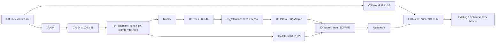
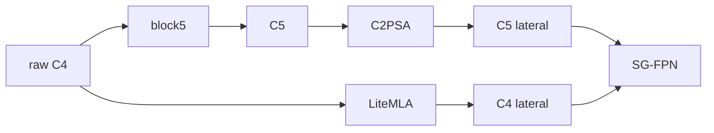
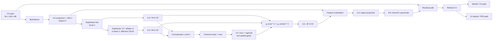
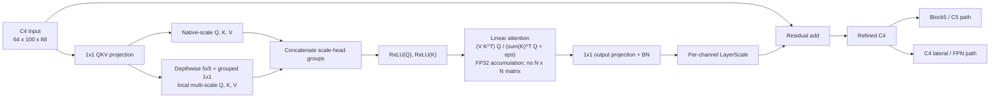

# C4 backbone ablations

## Config switches

All presets live in `configs/kitti/backbone_branch/`.

| Preset / Colab VARIANT | File | Encoding | FPN | C4 attention | C5 attention | Parameters |
|---|---|---|---|---|---|---:|
| B0 | kitti_mobilepixor_baseline.json | Legacy35 | sum | none | none | 598,073 |
| B1_C2PSA | kitti_mobilepixor_c2psa.json | RichBEV-8 | SG-FPN | none | c2psa | 626,825 |
| C4_LSK | kitti_mobilepixor_c4_lsk.json | RichBEV-8 | SG-FPN | lsk | none | 610,623 |
| C4_LITEMLA | kitti_mobilepixor_c4_litemla.json | RichBEV-8 | SG-FPN | litemla | none | 619,321 |
| RICH8_SGFPN_CONTROL | kitti_mobilepixor_rich8_sgfpn_control.json | RichBEV-8 | SG-FPN | none | none | 590,777 |
| C4_LITEMLA_LATERAL_ONLY | kitti_mobilepixor_c4_litemla_lateral_only.json | RichBEV-8 | SG-FPN | litemla (lateral only) | none | 619,321 |
| C4_DAT_LATERAL_ONLY | kitti_mobilepixor_c4_dat_lateral_only.json | RichBEV-8 | SG-FPN | dat (lateral only) | none | 608,713 |
| C4_BRA_LATERAL_ONLY | kitti_mobilepixor_c4_bra_lateral_only.json | RichBEV-8 | SG-FPN | bra (lateral only) | none | 608,249 |
| C4_LITEMLA_C5_C2PSA_SHARED | kitti_mobilepixor_c4_litemla_c5_c2psa_shared.json | RichBEV-8 | SG-FPN | litemla (shared) | c2psa | 655,369 |
| C4_LITEMLA_C5_C2PSA_DECOUPLED | kitti_mobilepixor_c4_litemla_c5_c2psa_decoupled.json | RichBEV-8 | SG-FPN | litemla (lateral only) | c2psa | 655,369 |

All parameter counts above include the configured detection head: each of its two
hidden 3x3 convolutions is followed by BatchNorm2d and SiLU, while the final
classification/regression convolution remains linear. This adds 256 trainable
parameters plus BatchNorm running-statistic buffers to every preset. Missing
`header_use_bn` and `header_act` fields deliberately retain the exact historical
head (`Conv -> Conv -> output Conv`) so its old state dictionary still loads
strictly. Enabling BN+SiLU requires a new training run; it is not checkpoint-
compatible with a legacy head.

The matched C4-only presets differ only in the selected C4 adapter/routing field
and descriptive note. They use RichBEV-8 + SG-FPN, enabled augmentation, physical
training batch 16 with two-step accumulation, and validation batch 16. B0 uses
Legacy35 + sum-FPN, so comparing any C4 preset directly with B0 is not a
single-factor attention ablation.

Set the independent switches in a config copy:

```json
{
  "model": {
    "backbone": "mobilepixor",
    "backbone_out_dim": 16,
    "cls_encoding": "gaussian",
    "c4_attention": "lsk",
    "c5_attention": "none",
    "scale_gated_fpn": true
  }
}
```

This fragment belongs inside a complete existing training config. C4 choices are
`none`, `lsk`, `litemla`, `dat`, and `bra`. C5 choices remain `none` and `c2psa`.
`data.bev_encoding.name` selects `binary_slices` (35 channels with this geometry)
or `rich8`. SG-FPN accepts a JSON Boolean. There is no automatic enabling of C2PSA,
SG-FPN, CoordAtt, UWAG, or a different encoding when C4 is enabled.

`model.c4_attention_route` is optional. `shared` is the legacy behavior: the
refined C4 tensor feeds both block5 and the C4 lateral. `lateral_only` sends raw
C4 to block5 and reserves the refined tensor for the lateral branch. Omitting the
field preserves `shared`, so existing configs and checkpoints keep their behavior.

The `shared` switch space is 5 C4 choices x 2 C5 choices x 2 encodings x
2 FPN choices = 40 configurations. `lateral_only` is an additional routing
ablation for enabled C4 adapters, not another attention mechanism. The committed
C4 pair uses Rich8, SG-FPN, and C5=`none`; test C2PSA interactions separately.
Enabling C4 and C5 together is supported but is a distinct experiment, not the
default C4 preset.

With Rich8, all counts decrease by 7,776 (27 fewer input channels x 32 stem
channels x 3 x 3). SG-FPN adds 480. C2PSA adds 36,048 relative to C5=`none`.
The adapters add 19,846 (LSK), 28,544 (LiteMLA), 17,936 (DAT), or 17,472
(BRA) parameters, independent of encoding/FPN.

## Placement and compatibility



Under the default `shared` route, both consumers of C4 receive the same refined
tensor. No feature resize or
target/decoder change is needed. `none` is parameter-free Identity: old B0/B1
state dicts load strictly only when the head configuration also matches.
Enabling an adapter introduces new checkpoint keys; start a new training run.
Do not resume an old off-mode checkpoint into an on-mode experiment. To reproduce
an older Colab run, use its original checkout/config/metadata rather than disabling
the resume guard. New default run names include all architecture switches and a
config hash to keep ablations separate.

### Why DAT and BRA are after C4, on the lateral-only route

The committed DAT and BRA presets refine the 64-channel C4 feature map after
`block4`, then send only that refined tensor to the C4 lateral projection. Raw C4
continues into `block5`; C5 attention remains disabled. This is deliberate:

- C4 is 100 x 88, while C5 is 50 x 44. DAT's learned sampling offsets and BRA's
  region routing therefore act before another 2x loss of spatial detail, which is
  the more defensible location for localization-sensitive BEV features.
- The lateral-only route leaves the raw `C4 -> block5` semantic path unchanged.
  It tests the new mechanism in the FPN path without also changing the input to
  block5, and without serializing it with a future C5 C2PSA experiment.
- C5 is not intrinsically invalid. It is a separate placement ablation that may
  be cheaper and more semantic, but it should not be mixed into the first
  mechanism comparison because location and mechanism would change together.

This is an experimental design argument, not proof that C4 will achieve better
AP. Compare each preset against `RICH8_SGFPN_CONTROL` under identical settings.

### Decoupled C4/C5 proposal

The decoupled preset changes only feature routing; parameter count and checkpoint
keys are identical to the shared LiteMLA+C2PSA combination:



This removes the direct `LiteMLA -> block5 -> C2PSA` serial path, but does not
prove that optimization interference is absent: both branches still share the
stem through block4 and their gradients meet at the SG-FPN output. Test it as a
routing ablation, not as a guaranteed fix.

The supplied results contain only one seed and lack the matched Rich8 + SG-FPN +
no-attention cell. A formal two-factor interaction needs all four cells (neither,
C4 only, C5 only, both) under identical training settings and multiple seeds. Use
`kitti_mobilepixor_rich8_sgfpn_control.json` for the missing control.

For a routing-aware study, run six cells: no attention; C2PSA only; LiteMLA only
with `shared`; LiteMLA only with `lateral_only`; both with `shared`; and both with
`lateral_only`. The committed presets make the last four routes explicit. This
separates an attention interaction from the effect of changing the block5 input.

## C4 mechanism diagrams

The controlled C4 variants occupy the same insertion point but implement
different operations. The diagrams below show LSK and LiteMLA; the DAT and BRA
dataflows are described in their implementation sections. None includes C2PSA
unless `c5_attention` is separately changed to `c2psa`.





## What is implemented

These modules are adaptations of published mechanisms. They do not reproduce the
entire original LSKNet, EfficientViT, DAT, or BiFormer block/backbone and do not
establish novelty or accuracy gains simply by being integrated here.

### LSKRefinement

BN -> pointwise projection -> GELU supplies features F. A depthwise 5x5 operation
produces U; a depthwise 7x7, dilation 3 operation on U produces V. Their effective
receptive fields are 5x5 and 23x23 at C4. Separate pointwise projections reduce
both to 32 channels. Channel mean/max summaries of their concatenation produce
two spatial sigmoid gates using a 7x7 convolution. These gates are independent,
not softmax-normalized and not scalar weights shared over the whole map.

The gated branch sum is projected to 64 channels, multiplies F, and passes through
an output pointwise projection. The result is added as `X + gamma * refinement`.
`gamma` is a learned per-channel LayerScale initialized to 0.01. This is near
identity, not exact identity. The large context branch spans a broad metric area;
its usefulness for sparse objects must be measured rather than assumed.

Compared with upstream: retain the spatial-selection mechanism, use a single
pre-normalized residual adapter with one LayerScale, and omit the additional MLP,
stochastic depth, and full backbone. Options: `model.lsk.layer_scale_init`.

### LiteMLARefinement

The native QKV projection and each locally aggregated QKV scale are treated as
separate groups of attention heads. Each scale uses a depthwise convolution and
grouped 1x1 mixing. Defaults are 4 heads of dimension 16 per scale, native plus
one 5x5 scale. For each group (channel-first layout):

```text
Q+ = ReLU(Q), K+ = ReLU(K)
output = ((V @ transpose(K+)) @ Q+) / (transpose(sum_positions(K+)) @ Q+ + eps)
```

There is no softmax and no spatial N x N attention matrix. At fixed head dimension,
attention scales linearly with spatial positions; channel-size intermediates are
computed first. The output is projected to 64 channels and batch-normalized, then
added through a learned LayerScale initialized to 0.01.

Compared with upstream: always use the linear formulation, accumulate numerator
and denominator in FP32 for both FP16 and BF16 input, use eps=1e-6, add LayerScale,
and omit the separate EfficientViT local MBConv/FFN. Existing MobilePIXOR blocks
continue to supply local processing. Options in `model.litemla`:

```json
{"head_dim": 16, "scales": [5], "eps": 0.000001, "layer_scale_init": 0.01}
```

`head_dim` must divide 64. Scale kernels must be distinct odd integers >=3;
`scales: []` is a native-scale-only ablation. These settings alter the experiment
and sometimes the state dict; record them through the full resolved config.

### DeformableAttentionRefinement (DAT)

The adapter projects a normalized C4 tensor to queries, divides the 64 channels
into four groups, and predicts one two-dimensional offset field per group with a
depthwise 5x5 stride-4 convolution. It bilinearly samples grouped C4 features at
the displaced reference points, projects sampled keys/values, and lets every C4
query attend to that reduced, content-dependent set. A depthwise 3x3 local
positional branch and pointwise output projection are added through LayerScale.

The stride-4 key/value grid is important: dense attention from all 8,800 C4
queries to all 8,800 locations is not practical here. This implementation keeps
DAT's grouped learned-offset sampling, but omits its complete transformer stage,
MLP, stochastic depth, and learned relative-position table. Sampling and softmax
run in FP32 under mixed precision. Options in `model.dat`:

```json
{"num_heads": 4, "num_groups": 4, "stride": 4, "offset_kernel_size": 5,
 "offset_range_factor": 2.0, "layer_scale_init": 0.01}
```

### BiLevelRoutingAttentionRefinement (BRA)

The adapter pads C4 to an 8 x 8 region grid. Detached average-pooled query/key
descriptors construct a coarse region graph; each query region selects its top
four key/value regions. Fine multi-head token attention is then computed only
inside those routed regions. A depthwise 3x3 local positional branch and
pointwise output projection are added through LayerScale.

This retains BiFormer's coarse-to-fine routing idea and the detached routing
decision used by its public NCHW implementation. The local code uses a plain
PyTorch gather so it has no custom CUDA dependency, supports dynamic BEV sizes,
and omits the complete BiFormer stage, MLP, and stochastic depth. Routing scores
and softmax run in FP32 under mixed precision. Options in `model.bra`:

```json
{"num_heads": 4, "n_win": 8, "topk": 4, "side_dwconv": 3,
 "layer_scale_init": 0.01}
```

Both mechanisms form considerably larger attention tensors than LiteMLA. In the
Colab notebook, start with its physical batch size of 2 and measure peak GPU
memory before increasing it. Keep effective batch size and the BatchNorm policy
consistent across variants when reporting a controlled comparison.

## Colab

Push these changes to `decoupled-c4-c5-routing` (or select the branch that contains them)
before running the notebook; a local edit is not available in Colab automatically.

```python
VARIANT = "C4_DAT_LATERAL_ONLY"  # or "C4_BRA_LATERAL_ONLY"
BEV_ENCODING_OVERRIDE = "rich8"       # or "binary_slices"
SCALE_GATED_FPN_OVERRIDE = True        # or False
C5_ATTENTION_OVERRIDE = "none"        # or "c2psa"
```

An override of `None` preserves the selected JSON value. `CONFIG_OVERRIDE` still
accepts a full custom config. The selector writes a resolved copy under
`artifacts/notebook_configs/` and all following cells use that copy. It prints the
actual switches, architecture, input shape, and parameter differences from B0.
The reference comparison explicitly disables C4/C5 attention and SG-FPN and uses
binary slices. Training, evaluation, checkpoint hashes, and TensorBoard run paths
follow the selected resolved config.

## Interpretation of the supplied screenshot

The visible 633.87K, 626.09K, and 626.57K counts match C2PSA with Legacy35+sum,
Rich8+sum, and Rich8+SG-FPN respectively. Counts are consistent with this code;
they do not verify the training recipe or checkpoint identity. These are B1-based
ablations, not pure B0. The baseline-plus-augmentation row has no visible result,
and the Rich8+SG-FPN row has an ambiguous epoch label. Do not attribute the full
61.04-to-73.00 difference to C2PSA without a matched augmented B0 run, or compare
rows as equal-budget experiments until their epochs/selection rules are checked.
The new C4 names intentionally avoid the screenshot's existing B2 designation.

## Validation and study design

Run with the project environment (on Colab use `python3`):

```text
python tests/test_c4_attention.py
python tests/test_mobile_bev.py --clean-backbone
python tests/test_standard_training_notebook.py
```

Checks cover unchanged B0 outputs, legacy strict checkpoint loading, all 40
switch combinations through a baseline-loss/optimizer step and checkpoint reload,
both C4 consumers, gradients, invalid switches, and linear attention equivalence
to explicit normalized kernel attention. ONNX/ONNX Runtime parity is checked when
installed; CUDA mixed precision is checked when supported by the local GPU.

Full 800x704 synthetic forward/backward checks were also run for the earlier C4
modules across both encodings/FPN choices. DAT and BRA additionally passed a
full-resolution Rich8 + SG-FPN batch-2 forward/backward with C5 disabled. These
prove functional execution; they are not KITTI accuracy measurements or a
training convergence guarantee. Measure target-GPU latency rather than infer
speed from parameter count.

ONNX and ONNX Runtime parity are tested at the exported input geometry. DAT's
sampling grid and BRA's region partition are traced from that spatial shape, so
the ONNX files should be treated as fixed-geometry artifacts. Re-export and test
again if the BEV geometry changes; TensorRT compatibility is not established by
the ONNX Runtime test.

Use the same augmentation, seeds, epochs, batch/accumulation settings, loss,
split, and checkpoint rule. Compare C4-only vs B0, then C4+SG-FPN vs their single
components. Report BEV AP, per-class/range results, throughput and memory, and
repeat finalists across multiple seeds. Keep C2PSA combinations labeled explicitly.

## References

- Li et al., Large Selective Kernel Network for Remote Sensing Object Detection,
  ICCV 2023: https://openaccess.thecvf.com/content/ICCV2023/html/Li_Large_Selective_Kernel_Network_for_Remote_Sensing_Object_Detection_ICCV_2023_paper.html
- Cai et al., EfficientViT: Multi-Scale Linear Attention for High-Resolution Dense
  Prediction, ICCV 2023: https://hanlab.mit.edu/projects/efficientvit
- Xia et al., Vision Transformer with Deformable Attention, CVPR 2022:
  https://openaccess.thecvf.com/content/CVPR2022/html/Xia_Vision_Transformer_With_Deformable_Attention_CVPR_2022_paper.html
- Zhu et al., BiFormer: Vision Transformer with Bi-Level Routing Attention,
  CVPR 2023: https://openaccess.thecvf.com/content/CVPR2023/html/Zhu_BiFormer_Vision_Transformer_With_Bi-Level_Routing_Attention_CVPR_2023_paper.html
- Upstream implementation/license references and modification notices:
  `third_party/attention/NOTICE.md`.
