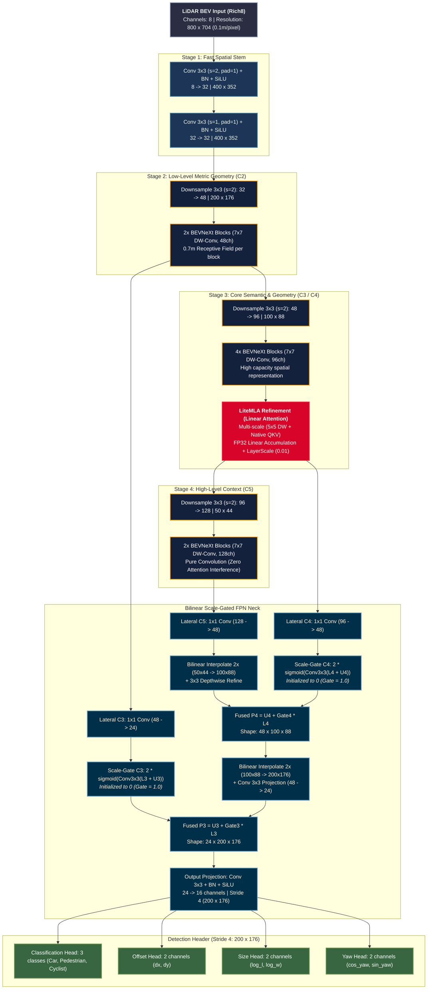
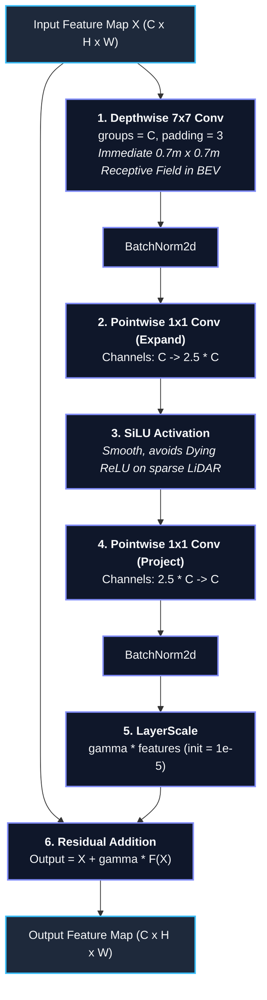

# BEVNeXt Architecture Specification & Diagrams

## 1. High-Level Pipeline Diagram

```mermaid
flowchart TD
    %% Styling
    classDef inputStyle fill:#2b2d42,stroke:#8d99ae,stroke-width:2px,color:#edf2f4;
    classDef stemStyle fill:#1d3557,stroke:#457b9d,stroke-width:2px,color:#f1faee;
    classDef stageStyle fill:#14213d,stroke:#fca311,stroke-width:2px,color:#ffffff;
    classDef attnStyle fill:#d90429,stroke:#ef233c,stroke-width:2px,color:#ffffff;
    classDef neckStyle fill:#003049,stroke:#669bbc,stroke-width:2px,color:#fdf0d5;
    classDef headStyle fill:#386641,stroke:#6a994e,stroke-width:2px,color:#ffffff;

    IN["<b>LiDAR BEV Input (Rich8)</b><br/>Channels: 8 | Resolution: 800 x 704 (0.1m/pixel)"]:::inputStyle

    %% Stem
    subgraph STEM_BLOCK ["Stage 1: Fast Spatial Stem"]
        S1["Conv 3x3 (s=2, pad=1) + BN + SiLU<br/>8 -> 32 | 400 x 352"]:::stemStyle
        S2["Conv 3x3 (s=1, pad=1) + BN + SiLU<br/>32 -> 32 | 400 x 352"]:::stemStyle
        S1 --> S2
    end
    IN --> S1

    %% Stage 2
    subgraph STAGE2 ["Stage 2: Low-Level Metric Geometry (C2)"]
        D2["Downsample 3x3 (s=2): 32 -> 48 | 200 x 176"]:::stageStyle
        B2["2x BEVNeXt Blocks (7x7 DW-Conv, 48ch)<br/>0.7m Receptive Field per block"]:::stageStyle
        D2 --> B2
    end
    S2 --> D2

    %% Stage 3
    subgraph STAGE3 ["Stage 3: Core Semantic & Geometry (C3 / C4)"]
        D3["Downsample 3x3 (s=2): 48 -> 96 | 100 x 88"]:::stageStyle
        B3["4x BEVNeXt Blocks (7x7 DW-Conv, 96ch)<br/>High capacity spatial representation"]:::stageStyle
        ATTN["<b>LiteMLA Refinement (Linear Attention)</b><br/>Multi-scale (5x5 DW + Native QKV)<br/>FP32 Linear Accumulation + LayerScale (0.01)"]:::attnStyle
        D3 --> B3
        B3 --> ATTN
    end
    B2 --> D3

    %% Stage 4
    subgraph STAGE4 ["Stage 4: High-Level Context (C5)"]
        D4["Downsample 3x3 (s=2): 96 -> 128 | 50 x 44"]:::stageStyle
        B4["2x BEVNeXt Blocks (7x7 DW-Conv, 128ch)<br/>Pure Convolution (Zero Attention Interference)"]:::stageStyle
        D4 --> B4
    end
    ATTN --> D4

    %% FPN Neck
    subgraph FPN_NECK ["Bilinear Scale-Gated FPN Neck"]
        direction TB
        L5["Lateral C5: 1x1 Conv (128 -> 48)"]:::neckStyle
        L4["Lateral C4: 1x1 Conv (96 -> 48)"]:::neckStyle
        L3["Lateral C3: 1x1 Conv (48 -> 24)"]:::neckStyle

        U4["Bilinear Interpolate 2x (50x44 -> 100x88)<br/>+ 3x3 Depthwise Refine"]:::neckStyle
        GATE4["Scale-Gate C4: 2 * sigmoid(Conv3x3(L4 + U4))<br/><i>Initialized to 0 (Gate = 1.0)</i>"]:::neckStyle
        FUSE4["Fused P4 = U4 + Gate4 * L4<br/>Shape: 48 x 100 x 88"]:::neckStyle

        U3["Bilinear Interpolate 2x (100x88 -> 200x176)<br/>+ Conv 3x3 Projection (48 -> 24)"]:::neckStyle
        GATE3["Scale-Gate C3: 2 * sigmoid(Conv3x3(L3 + U3))<br/><i>Initialized to 0 (Gate = 1.0)</i>"]:::neckStyle
        FUSE3["Fused P3 = U3 + Gate3 * L3<br/>Shape: 24 x 200 x 176"]:::neckStyle

        OUT_PROJ["Output Projection: Conv 3x3 + BN + SiLU<br/>24 -> 16 channels | Stride 4 (200 x 176)"]:::neckStyle

        L5 --> U4
        U4 --> FUSE4
        L4 --> GATE4 --> FUSE4
        FUSE4 --> U3
        L3 --> GATE3 --> FUSE3
        U3 --> FUSE3
        FUSE3 --> OUT_PROJ
    end

    B4 --> L5
    ATTN --> L4
    B2 --> L3

    %% Header
    subgraph HEADS ["Detection Header (Stride 4: 200 x 176)"]
        H_CLS["Classification Head: 3 classes (Car, Pedestrian, Cyclist)"]:::headStyle
        H_OFF["Offset Head: 2 channels (dx, dy)"]:::headStyle
        H_SIZ["Size Head: 2 channels (log_l, log_w)"]:::headStyle
        H_YAW["Yaw Head: 2 channels (cos_yaw, sin_yaw)"]:::headStyle
    end

    OUT_PROJ --> H_CLS
    OUT_PROJ --> H_OFF
    OUT_PROJ --> H_SIZ
    OUT_PROJ --> H_YAW
```

---

## 2. Micro-Architecture: `BEVNeXtBlock` Detail

```mermaid
flowchart TD
    classDef main fill:#1e293b,stroke:#38bdf8,stroke-width:2px,color:#f8fafc;
    classDef op fill:#0f172a,stroke:#818cf8,stroke-width:2px,color:#f8fafc;

    X["Input Feature Map X (C x H x W)"]:::main
    
    DW["<b>1. Depthwise 7x7 Conv</b><br/>groups = C, padding = 3<br/><i>Immediate 0.7m x 0.7m Receptive Field in BEV</i>"]:::op
    BN1["BatchNorm2d"]:::op
    PW1["<b>2. Pointwise 1x1 Conv (Expand)</b><br/>Channels: C -> 2.5 * C"]:::op
    ACT["<b>3. SiLU Activation</b><br/><i>Smooth, avoids Dying ReLU on sparse LiDAR</i>"]:::op
    PW2["<b>4. Pointwise 1x1 Conv (Project)</b><br/>Channels: 2.5 * C -> C"]:::op
    BN2["BatchNorm2d"]:::op
    SCALE["<b>5. LayerScale</b><br/>gamma * features (init = 1e-5)"]:::op
    ADD["<b>6. Residual Addition</b><br/>Output = X + gamma * F(X)"]:::op

    X --> DW
    DW --> BN1
    BN1 --> PW1
    PW1 --> ACT
    ACT --> PW2
    PW2 --> BN2
    BN2 --> SCALE
    X ---> ADD
    SCALE --> ADD
    ADD --> OUT["Output Feature Map (C x H x W)"]:::main
```
