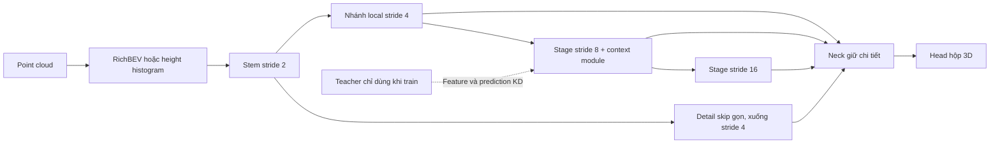

# Hướng cải tiến MobilePixorNeXt cho KITTI và TensorRT/Jetson

## Current implementation documents (English)

Start with the English [document index](INDEX.md). The accepted design is specified in [specification.md](specification.md), [attention_specification.md](attention_specification.md) and [implementation_plan.md](implementation_plan.md): hist14, stage depths 3/4/2, focal context at stride 8, optional ECA/SimAM at stride 4, 32-channel SG-FPN output, compatible grouped heads and a separate full 3D milestone. The [experiment manifest](experiment_manifest.json) describes explicit recipe choices. GPU accuracy is the priority; distillation and Jetson/TensorRT optimization are excluded. Features are planned, not implemented or accuracy-validated.

The research report below is retained as historical background. Its broader alternatives, including distillation and support-conditioned context/deployment experiments, are not all part of the accepted scope. The revision-2 specifications above determine the current implementation scope.

Ngày khảo sát: **06-10-2026**. Yêu cầu đã xác nhận: **chỉ backbone <1.000.000 tham số**, KITTI, GPU/TensorRT/Jetson. Kiến trúc được khảo sát là `mobilepixornext`, backbone mặc định trong `configs/config.json`. Đây là báo cáo nghiên cứu và thiết kế đề xuất; chưa huấn luyện hay đo accuracy/latency của kiến trúc mới.

## 1. Khuyến nghị

Giữ backbone CNN BEV hiện có, cải tiến theo thứ tự: **giữ chi tiết hình học ở tầng sớm → context nhiều mức rẻ hơn attention → distillation theo foreground → tối ưu TensorRT trên Jetson**. Câu hỏi nghiên cứu nên là: *với backbone dưới 1M, bảo toàn tín hiệu hình học và điều chỉnh context theo mức hỗ trợ của point cloud có hiệu quả hơn tăng width/depth hoặc attention thông thường không?*

Các kết quả đã kiểm tra chưa đủ chứng minh backbone nào chắc chắn đạt SOTA accuracy tuyệt đối năm 2026 trong điều kiện này. Mục tiêu nghiên cứu khả thi là SOTA/Pareto trong nhóm **LiDAR-only, cùng dữ liệu và protocol, backbone <1M**, đồng thời đo deployment thực tế. Các phương pháp đề xuất dưới đây là giả thuyết cần kiểm chứng, không phải kết quả đã đạt. Khảo sát chỉ bao phủ thông tin truy cập được đến ngày 06-10-2026.

## 2. Backbone hiện tại: đã dưới ngân sách

Đã khởi tạo trực tiếp các lớp của mã hiện tại bằng PyTorch trên meta device và đếm `numel()`. Không dựa vào mô tả "under 2M" trong docstring. Bằng chứng nằm trong [architecture_evidence.json](architecture_evidence.json), script tái lập ở [profile_architecture.py](profile_architecture.py).

| Biến thể được khởi tạo | Backbone chính | Neck | `model.backbone` gồm neck | Toàn detector BEV |
| --- | ---: | ---: | ---: | ---: |
| Config mặc định | 647.200 | 27.056 | 674.256 | 693.097 |
| Bỏ LiteMLA, giữ neck/head | 589.024 | 27.056 | 616.080 | 634.921 |
| Output neck/head input 32 | 647.200 | 30.544 | 677.744 | 752.281 |
| Expansion 3,0 | 721.440 | 27.056 | 748.496 | 767.337 |
| Expansion 4,0 | 869.920 | 27.056 | 896.976 | 915.817 |
| MS LiteMLA [3,5] + RMSNorm | 663.648 | 27.056 | 690.704 | 709.545 |
| RC-SGFPN | 647.200 | 27.704 | 674.904 | 693.745 |
| RC-BiSGFPN | 647.200 | 64.280 | 711.480 | 730.321 |
| RepConv, topology training | 656.768 | 27.056 | 683.824 | 702.665 |
| RepConv, topology deploy | 646.464 | 27.056 | 673.520 | 692.361 |

Các số trên gồm weight, bias, tham số affine của normalization và LayerScale; không tính running buffers. RepConv deploy chỉ phản ánh topology fusion đang được mã hỗ trợ, chưa fuse mọi Conv-BN của detector. Các biến thể trong bảng là thay đổi cấu hình độc lập, không phải tổ hợp; đây là số tham số, chưa có AP của từng biến thể.

Encoder RichBEV là thống kê cố định, không có learned parameters, nhưng vẫn có chi phí xử lý. Khi công bố nên tách **encoder / backbone chính / neck / head / total**. Vì code gộp neck trong `model.backbone`, nên giữ thêm con số gồm neck; cách này bảo thủ hơn khi kiểm tra giới hạn <1M.

### Kiến trúc và nút thắt

Input `rich8`: 8×800×704, cell 0,1 m. Stem stride 2, 32 channels; stage stride 4/8/16 lần lượt 48/96/128 channels, depth 2/4/2; inverted bottleneck DW7×7, expansion 2,5; LiteMLA tại stride 8; SG-FPN trả output stride 4 với 16 channels.

`rich8` thực tế chứa 3 occupancy height bands, max/mean height, max/mean intensity và log-density. **Không có channel range trong rich8 hiện tại.** `rich12` thêm height span, height std, intensity contrast và density có bù range. Một số roadmap cũ mô tả encoding, head và loss khác mã hiện tại; nghiên cứu này lấy mã/config làm nguồn chuẩn.

Shape audit cho input batch 1 ghi nhận **7,6288 GMAC riêng các Conv2d của toàn detector**. Stem chiếm 1,6220 GMAC, khoảng 21,3%, dù chỉ có 11.648 tham số. Riêng convolution trong LiteMLA là 0,5094 GMAC. MAC audit chưa tính matmul attention, normalization, activation, resize, phép toán phần tử, rasterization hoặc NMS; không coi nó là tổng FLOPs hay latency đo được. Theo quy ước multiply-add = 2 FLOPs, phần convolution tương đương khoảng 15,2577 GFLOPs.

Vì vậy, giảm parameter chưa đủ làm Jetson nhanh hơn. Stem, activation và di chuyển dữ liệu cần được profile cùng attention. Tăng expansion đồng loạt là đối chứng dễ làm, nhưng không mặc định là phương án tối ưu.

### Điều kiện bắt buộc để nghiên cứu detection 3D

Head hiện chỉ có `cls`, `offset(2)`, `size(2)` và `yaw(2)`, tùy chọn quality IoU. Không dự đoán z/height. Evaluator hiện là **local loader-aligned rotated BEV AP R40**, không phải official KITTI 3D AP. Cần mở rộng target/head/decode để dự đoán hộp `(x,y,z,l,w,h,yaw)`, quy đổi LiDAR/camera đúng calibration và đánh giá bằng evaluator KITTI chuẩn có xử lý difficulty/ignored objects/DontCare phù hợp. KITTI 3D benchmark sử dụng overlap hộp 3D. [KITTI chính thức](https://www.cvlibs.net/datasets/kitti/eval_3dobject.php)

Tham số head mới phải báo cáo riêng; user chỉ giới hạn backbone. Nếu giữ head BEV thì chỉ có thể kết luận cho BEV detection.

## 3. Các nghiên cứu đáng sử dụng

| Nguồn | Bằng chứng đã xác minh | Cách dùng cho repo |
| --- | --- | --- |
| Dense Backbone, ICCV Workshops 2025 | Table 4: DensePointPillars backbone 0,47M; DensePillarNet backbone 0,69M. Neck/head lớn nên backbone nhỏ không đồng nghĩa detector nhỏ. | Comparator trực tiếp trong nhóm <1M; học feature reuse, đo chi phí concat. |
| PillarHist, CVPR 2025 | Height-aware histogram nhằm giữ thông tin chiều cao và thuận lợi cho quantization. | Đối chứng mạnh cho rich8/rich12 và thiết kế height bins. |
| SFMNet, WACV 2026 | Focal modulation kết hợp context nhiều mức; ablation CenterPoint trên 20% Waymo: L2 mAPH 66,9→69,5. | Chuyển nguyên lý sang dense 2D để đối chiếu LiteMLA; kết quả sparse không chứng minh adaptation mới. |
| FALO, CVPR Workshops 2026 | ConvDotMix với convolution, Hadamard product và linear layers; có ONNX/TensorRT trên Jetson Orin. | Tham khảo interaction rẻ và layout thuận lợi deployment; không sao chép toàn serialized voxel pipeline. |
| Mamba-based KD, preprint 04-08-2026 | Table I có student nhỏ nhất 1,74M **toàn model**; student-h 4,11M. | Học box-aware distillation. Không suy ra backbone vượt/đạt 1M nếu thiếu breakdown. |
| M3DNet, ICAART 2026 | KITTI official test 3D AP Moderate: Car 73,87; Pedestrian 36,93; Cyclist 55,64. | Baseline cập nhật 2026; chưa xác minh parameter breakdown, không gắn nhãn <1M. |

Dense Backbone có thêm cảnh báo thực tế: Table 6 ghi DensePointPillars 51 FPS trên A100 và 9 FPS trên Orin Nano, so với PointPillars 60 và 12 FPS. Feature reuse giảm tham số/FLOPs nhưng tăng memory traffic. Đây là lý do phải kiểm tra cả accuracy và latency. [Paper và bảng thành phần](https://arxiv.org/html/2508.00744v1)

PillarHist là prior art quan trọng: height histogram đã có trước năm 2026. Thêm histogram đơn thuần không đủ chứng minh tính mới. [CVPR 2025](https://openaccess.thecvf.com/content/CVPR2025/html/Zhou_PillarHist_A_Quantization-aware_Pillar_Feature_Encoder_based_on_Height-aware_Histogram_CVPR_2025_paper.html)

SFMNet là sparse detector; focal modulation dense được đề xuất ở đây chỉ là adaptation. Phải đo lại trên KITTI/Jetson và đối chiếu generic focal modulation. [WACV 2026](https://openaccess.thecvf.com/content/WACV2026/html/Shrout_SFMNet_Sparse_Focal_Modulation_for_3D_Object_Detection_WACV_2026_paper.html), [ablation gốc](https://arxiv.org/html/2503.12093v1)

FALO có preprint năm 2025 và publication workshop năm 2026. Không có bằng chứng backbone <1M trong khảo sát này. Độ tương thích operator và tốc độ trên thiết bị nhúng là lý do chọn làm tài liệu thiết kế. [Publication](https://openaccess.thecvf.com/content/CVPR2026W/ECV/html/Han_FALO_Fast_and_Accurate_LiDAR_3D_Object_Detection_on_Resource-Constrained_CVPRW_2026_paper.html), [bản đầy đủ](https://arxiv.org/html/2506.04499v1)

KD paper năm 2026 cho thấy cách chuyển feature trong vùng object, nhưng không chứng minh một CNN BEV dưới 1M đạt cùng hiệu quả. Số tham số toàn model không được dùng để kết luận số tham số riêng backbone. [Mamba KD](https://arxiv.org/html/2608.03490v1)

M3DNet có publication 2026 nhưng submission KITTI được ghi ngày 02-06-2025. Đây là ví dụ cần phân biệt ngày công bố và ngày benchmark. Các AP test kể trên không được so trực tiếp với AP local trong repo. [KITTI entry](https://www.cvlibs.net/datasets/kitti/eval_object_detail.php?result=a036a2d2b08df9c611b84669fd7440b596b8ef76)

PillarNeXt vẫn là reference về thiết kế pillar và receptive field, dù publication 2023. Các detector mạnh như VoxelNeXt/SAFDNet/DSVT có thể dùng làm accuracy reference hoặc teacher; không mặc định coi chúng là baseline dưới 1M. [PillarNeXt](https://openaccess.thecvf.com/content/CVPR2023/html/Li_PillarNeXt_Rethinking_Network_Designs_for_3D_Object_Detection_in_LiDAR_CVPR_2023_paper.html)

Đã kiểm tra thêm SoftRangeBEV: publisher hiển thị DOI năm 2026 nhưng issue date 01-01-2027; search index truy cập được tại thời điểm khảo sát. Chưa xác minh ngày online-first và toàn văn. Xem đây là prior-art cần kiểm tra cho range-conditioned BEV, không đưa vào bảng SOTA 2026 đã xác lập. [Publisher](https://www.sciencedirect.com/science/article/pii/S0925231226025518)

## 4. Thiết kế đề xuất

### Hướng A — Ưu tiên đầu tiên: giữ hình học nhỏ

Stride 4 hiện tương đương 0,4 m/cell. Vật thể có bề ngang 0,6 m chỉ rộng khoảng 1,5 cells. Đây là giả thuyết mất chi tiết cần kiểm tra bằng feature/GT và các lỗi Pedestrian/Cyclist.

Thử tăng depth stage stride 4 từ 2 lên 3 hoặc 4, hoặc thêm detail skip từ stem stride 2 xuống stride 4 qua DW convolution + pooling/downsample + PW projection. Giữ output stride 4 ở vòng đầu để kiểm soát compute. So sánh cách downsample thường với phương án pooling/anti-alias; không mặc định low-pass tốt hơn vì có thể làm mờ cấu trúc mảnh. Tránh mở toàn head ở stride 2 trước khi biết latency và lợi ích.

Đối chứng encoding: rich8; rich12; histogram 4/8 height bins với count/intensity statistics; bản encoder học rất nhỏ nếu histogram có lợi. Ground-relative height là thử nghiệm riêng, cần đo cả thời gian ước lượng ground và tính ổn định. Mọi thay đổi encoding phải được tách khỏi thay đổi backbone.

### Hướng B — Context module nhiều mức để đối chiếu LiteMLA

Prototype đề xuất: input 96 channels tại stride 8; bottleneck 64; ba DW3×3 có dilation 1/2/3; một context pooled theo support của point cloud; gate trộn local/global context; Hadamard modulation và residual projection trở về 96 channels. So sánh hierarchical dilation với DW7×7 để kiểm tra gridding artifact.

Một cấu hình lý thuyết gồm projection `96→132` (hai nhánh 64 và bốn gates), DW layers, projection `64→64→96`, pre/output BN và LayerScale có khoảng **25.120 tham số** nếu không dùng bias convolution: `96×132 + 3×64×9 + 64×64 + 64×96 + 2×96 + 2×96 + 96`. Đây là **ước lượng thiết kế**, chưa khởi tạo module. LiteMLA hiện có 58.176 tham số. Cần đếm lại sau implementation và đo TensorRT vì dilation/elementwise/resize đều có thể gây overhead.

Thứ tự kiểm chứng: no-context → LiteMLA → focal generic → focal có support mask → focal điều kiện theo density/height → thêm range nếu còn lợi ích. Support ở mỗi scale nên được tổng hợp từ occupancy/count; context pooled dùng tổng feature có trọng số chia tổng support có epsilon. Mask chỉ điều chỉnh context, không triệt tiêu output tại cell rỗng vì center vật thể có thể không có point.

Không đồng nhất range với độ tin cậy: hai vật thể cùng khoảng cách có thể rất khác số point và occlusion. Chứng minh gate điều kiện tốt hơn gate theo feature đơn thuần và range-only. Dense gating **không tự giảm computation bằng sparsity**; giảm latency phải đến từ module/operator hoặc execution scheme được đo.

### Hướng C — Distillation theo foreground

Sau khi chọn student tốt nhất, train teacher mạnh trên cùng KITTI split. Thử teacher CNN/voxel chuẩn trước, chưa cần Mamba. Distill BEV feature đã căn chỉnh hệ tọa độ/stride và foreground classification/box predictions; cân bằng lớp để Car không chi phối, kiểm tra riêng object ít point.

Teacher voxel có thông tin chiều cao khác student raster BEV: phải định nghĩa projection/aggregation và alignment rõ ràng, không MSE mọi voxel với mọi BEV cell. So với KD generic và teacher-guided initialization. Teacher, projector và auxiliary heads bị loại khi deploy; backbone student giữ nguyên số tham số.

### Ngân sách và đối chứng đơn giản

Giữ trần thiết kế **0,90–0,95M gồm neck** để có khoảng dư. Không cần dùng hết ngân sách nếu model nhỏ hơn có Pareto tốt hơn. Expansion 3 và 4 đã có cấu hình khởi tạo hợp lệ dưới 1M; đây là đối chứng bắt buộc để xem module mới có đáng giá hơn việc thêm capacity không. Output neck/head input 32 là thử nghiệm riêng: backbone chính không đổi, nhưng head tăng 18.841→74.537 tham số và compute tại stride 4 tăng đáng kể. Không quy gain của head rộng cho backbone.

Nếu detail path/encoding có lợi, ưu tiên chúng trước RC-BiSGFPN hay attention thứ hai. Reparameterization và quality head đã có trong repo; không coi việc bật flag là đóng góp mới. Không mặc định bật đồng thời rich12, MS attention, reparam, RC neck và loss mới.

## 5. Kế hoạch thí nghiệm có thể bắt đầu ngay

| Nhóm | Thay đổi duy nhất hoặc đối chứng | Điều cần trả lời |
| --- | --- | --- |
| B0 | Head/target/decode 3D chuẩn, cùng training recipe | Thiết lập baseline 3D đáng tin cậy |
| B1 | B0 bỏ LiteMLA | Attention có giúp thật không? |
| B2/B3 | Expansion 3/4 | Capacity đơn giản tốt đến đâu trong <1M? |
| G1 | Thêm block stage stride 4 | Local geometry hay deep capacity quan trọng hơn? |
| G2 | Detail skip từ stem | Detail skip có tốt hơn tăng depth cùng budget? |
| C1 | Thay LiteMLA bằng focal generic | Module convolution/gating có Pareto tốt hơn? |
| C2 | C1 thêm occupancy/point support | Support-aware context có tăng accuracy ổn định? |
| C3 | C2 thêm density/height, range riêng | Gain đến từ tín hiệu nào? |
| E1 | Thay encoding, giữ backbone cố định | Mất thông tin ở rasterization có phải nút thắt? |
| K1 | Student tốt nhất + foreground KD | Huấn luyện giúp tăng accuracy mà không tăng deploy params? |

Chạy đối chứng với cùng source commit, encoder, neck/head, loss, augmentation, schedule, batch, inference thresholds và checkpoint selection. Sau ablation riêng mới kết hợp hai thành phần thắng. So cả equal-parameter và equal-latency; bổ sung Dense Backbone <1M trong cùng detector hoặc giải thích rõ pipeline khác biệt nếu chỉ đối chiếu paper-reported results.

Split hiện có **3.712 train / 3.769 val**. Báo cáo archive trong repo có nhiều run ở **5.984 / 1.497**, vì vậy không ghép AP hai split để kết luận. Chọn baseline theo dữ liệu: báo cáo archive ghi baseline + IQA tốt hơn một số geometry losses, nên không mặc định OGA là baseline mạnh nhất. Những giá trị 90–91% ở archive là local BEV AP, không đổi tên thành 3D AP. [Phân tích archive](../../plans/attention_artifact_review.md), [so sánh loss/head](../../plans/oga_iqa_vs_qoga_review.md)

Primary metrics: KITTI AP3D R40 Easy/Moderate/Hard theo từng lớp; APBEV là phụ; Car Moderate theo leaderboard và mean Moderate ba lớp cho nghiên cứu multi-class. Phân tích thêm distance × number of points/object × occlusion. Báo số GT mỗi nhóm; không dùng vài mẫu ở vùng xa làm kết luận mạnh. Khóa quy tắc chọn checkpoint theo AP3D validation cho mọi run; không so `best` theo loss khác nhau giữa các strategy. Xác nhận candidate cuối với ít nhất ba seeds và bootstrap theo frame.

Muốn tuyên bố SOTA trên KITTI test phải có submission test phù hợp. Muốn tuyên bố đóng góp backbone tổng quát nên xác nhận thêm nuScenes/Waymo; không suy ra khả năng tổng quát từ KITTI một mình.

## 6. TensorRT/Jetson: phép đo quyết định lựa chọn

Xuất ONNX, kiểm tra agreement với PyTorch và đo lại AP sau TensorRT. FP16 là mốc đầu; INT8/PTQ hoặc QAT là bước riêng, không giảm số parameter. Kiểm tra calibration sample đại diện Car/Pedestrian/Cyclist và vùng xa. Không dùng FPS dGPU để suy ra FPS Jetson.

Ghi model Jetson cụ thể (Orin Nano/NX/AGX), power mode, clocks, JetPack/CUDA/TensorRT, input shape, batch 1 và precision. Đo riêng rasterization, transfer, backbone, neck/head, decode/NMS và toàn pipeline. Dùng CUDA events/synchronization phù hợp, warmup đến trạng thái ổn định, báo p50/p95 cùng mean, peak memory và công suất khi có thiết bị. Phải tính cả dữ liệu di chuyển và synchronization. [NVIDIA benchmarking](https://docs.nvidia.com/deeplearning/tensorrt/latest/performance/benchmarking.html), [operator optimization](https://docs.nvidia.com/deeplearning/tensorrt/latest/performance/optimization.html)

Acceptance gate đề xuất: backbone gồm neck <1M; cải thiện AP3D có bằng chứng nhiều seeds hoặc giữ AP nhưng giảm latency/memory; không regress rõ Pedestrian/Cyclist; có artifact reproducible và Pareto trên Jetson. Mốc screening như +1 điểm mean AP3D Moderate hoặc -15% latency ở AP gần tương đương là tiêu chí lựa chọn thực nghiệm, **không phải định nghĩa SOTA**.

## 7. Phạm vi đã hoàn thành và phần cần thực nghiệm

Đã đọc architecture/config/head/evaluator và báo cáo thực nghiệm local, tra nguồn sơ cấp 2023–2026, đếm tham số mười cấu hình, audit shape/MAC convolution và lập hướng cải tiến. Chưa implementation module mới, chưa bổ sung 3D head, chưa train/evaluate accuracy, chưa có phép đo TensorRT hoặc Jetson. Vì vậy thiết kế mới có cơ sở nghiên cứu nhưng chưa có bằng chứng hiệu quả hoặc SOTA.
