# Lightweight LiDAR detector improvement specification

Date: 2026-10-06  
Updated: 2026-10-07  
Status: implementation-ready design; features below are not implemented by this document.  
Design revision: 2, including focal context and configurable lightweight attention.  
Working branch: `research/mobilepixornext-under1m`, based on hybrid GT augmentation commit `3654a0b`. The existing uncommitted Q-OGA, training, and notebook changes are part of the working-tree context and must be preserved.

This specification, [attention_specification.md](attention_specification.md) and [implementation_plan.md](implementation_plan.md) are the authoritative implementation documents. The attention document defines exact operators, initialization, placement and optional detail/fusion variants. Earlier research notes describe alternatives, including ideas that are excluded from the first release.

## 1. Objective and release boundaries

Build a KITTI LiDAR detector candidate that preserves more point geometry, strengthens local BEV processing, and supports separate Car and Pedestrian/Cyclist task heads. The backbone, **including its integrated neck**, must contain strictly fewer than 1,000,000 learned parameters. The limit does not apply to the heads or train-only loss parameters; report those separately.

The immediate priority is GPU accuracy evaluation against other algorithms. This is a research candidate, not a demonstrated 2026 SOTA result. Unit tests establish correctness; trained checkpoints and matched evaluation establish accuracy.

Two delivery milestones are explicit:

| Milestone | Deliverable | Permitted metric claims |
| --- | --- | --- |
| A: compatible BEV candidate | hist14, local stage depth 3/4/2, focal context, configurable ECA/SimAM, output width 32, grouped heads, supported loss/IQA integration, GPU pipeline | Current local, loader-aligned rotated BEV AP R40, labelled with its protocol |
| B: complete 3D detector | Predicted vertical position/height, complete 3D decoding, calibration conversion, reference KITTI evaluation | KITTI AP3D R11 and R40 after evaluator parity and training; switchable reference APBEV mode |

Milestone B is required before comparisons to algorithms reporting 3D AP. If there is budget for only one long training run and the intended comparison is 3D, perform Milestone A smoke checks, then complete Milestone B before that run. Do not train A and present its BEV AP as 3D AP.

### Required first architecture

```mermaid
flowchart LR
    P[Raw KITTI points and boxes] --> A[Existing hybrid GT and global augmentation]
    A --> E[hist14 rasterization]
    E --> S[Legacy convolution stem: stride 2, width 32]
    S --> C3[Stride 4: width 48, depth 3]
    C3 --> LA[Optional ECA or SimAM residual adapter]
    LA --> C4[Stride 8: width 96, depth 4]
    C4 --> F[Feature-based multiscale focal context]
    F --> C5[Stride 16: width 128, depth 2]
    LA --> N[SG-FPN: output width 32, stride 4]
    F --> N
    C5 --> N
    N --> H1[Car: classification, box regression, optional IQA]
    N --> H2[Pedestrian and Cyclist: classification, box regression, optional IQA]
    H1 --> D[Decode by group, map global classes, per-class NMS]
    H2 --> D
```



The main candidate uses expansion 2.5, legacy stem, existing SG-FPN laterals 24/48/48, feature-based focal context at stride 8, BatchNorm and SiLU in heads, and no LiteMLA. Local attention defaults to none; the first optional adapter is ECA at stride 4, with SimAM as a comparison. Keep a named no-context/no-local-attention reference config. Implementing alternatives does not require multiple long training runs.

The 32-channel output improves the interface to the head; it does not undo information compressed by the existing 24-channel final lateral. Wider internal fusion and a stem-detail path are explicit optional follow-ups specified in the attention document; they are not enabled in the main recipe.

### Excluded from the first release

Distillation; support/height-conditioned focal gates; stage-level dense/one-shot aggregation; Coordinate Attention/CBAM; range-conditioned or bidirectional neck changes; depthwise stem replacement; new reparameterization; ground removal; changing grid resolution, target radii, or augmentation recipe; Jetson, TensorRT, INT8, and deployment latency tuning. Keep historical options available for checkpoint reproduction. Optional detail/fusion work is sequenced after the core candidate and requires its own config/verification.

## 2. Requirements and traceability

| ID | Requirement | Acceptance evidence |
| --- | --- | --- |
| R01 | Backbone plus neck <1M | Instantiated parameter report and budget assertion |
| R02 | Encoding schema has one source of truth | Dataset/model/notebook/input-shape agreement and legacy parity |
| R03 | hist14 has exact, finite, versioned semantics | Analytic fixtures, boundary checks, permutation invariance |
| R04 | Optimized encoding preserves semantics and augmentation order | NumPy/Numba parity and hybrid integration |
| R05 | Candidate removes LiteMLA and adds one stride-4 block | Module audit, shape checks, finite backward |
| R06 | Group targets and heads are independent | Same-cell cross-group fixture and gradient isolation |
| R07 | Existing supported losses and IQA remain supported | Strategy capability matrix, routing and gradient checks |
| R08 | Adaptive loss state is independent and reproducible | Per-group parameter/EMA registration and resume equivalence |
| R09 | Decode preserves box/quality/class associations | Known-box roundtrip, IQA ranking and NMS fixtures |
| R10 | Legacy single-head behavior remains reproducible | Outputs, losses, gradients and state-dict parity |
| R11 | GPU training/evaluation handles grouped structures | Device transfer, AMP, optimizer and evaluation smoke checks |
| R12 | Protocol and architecture identities are recorded | Config/checkpoint/report metadata and mismatch rejection |
| R13 | Full 3D claims require complete 3D task and reference evaluation | Vertical targets, calibrated roundtrip, reference AP3D/APBEV parity for both R11 and R40 |
| R14 | Focal context has defined multiscale/global fusion and stable residual behavior | Operator fixtures, normalized gates, identity/gradient/AMP checks |
| R15 | ECA/SimAM are selectable, isolated and fully accounted for | Core/wrapper counts, FP32 statistics, routing and state checks |
| R16 | Optional detail/fusion changes preserve alignment and output contract when enabled | Explicit config validation, shape/count/gradient/resume evidence |

Every implementation task must reference the relevant requirements and produce evidence before its feature is enabled in a training preset.

## 3. Configuration and shared contracts

### 3.1 One grouping definition

Introduce a pure, PyTorch-independent module `detector/core/task_groups.py`. It resolves group definitions against `data.kitti.objects`, returning stable names, ordered global IDs, and local/global mappings. Dataset, model, criterion, decoder, and metadata must consume this resolver rather than maintain separate class lists.

Proposed config fields:

```json
{
  "data": {
    "bev_encoding": {
      "name": "hist14",
      "version": 1,
      "density_norm": 32.0,
      "intensity_scale": 1.0,
      "backend": "numpy"
    },
    "head_groups": [
      {"name": "car", "classes": ["Car"]},
      {"name": "ped_cyc", "classes": ["Pedestrian", "Cyclist"]}
    ]
  },
  "model": {
    "head_mode": "grouped",
    "stage_depths": [3, 4, 2],
    "backbone_out_dim": 32,
    "c4_attention": "none",
    "c4_attention_scales": [],
    "c4_attention_qk_norm": "none",
    "c4_context": "focal",
    "c4_context_version": 1,
    "c4_context_bottleneck": 64,
    "c4_context_dilations": [1, 2, 3],
    "c4_context_layer_scale_init": 0.001,
    "local_attention": "none",
    "neck_fusion_channels": 24,
    "detail_path": false,
    "header_use_iou": true
  },
  "loss": {
    "name": "oga",
    "use_iou": true,
    "group_weights": {"car": 1.0, "ped_cyc": 1.0}
  }
}
```

This is an illustrative override, not a runnable complete config. Geometry, training schedule, SG-FPN, expansion, augmentation, and other loss settings are inherited and saved in the fully resolved config. OGA+IQA is the integration preset; baseline+IQA remains a companion preset. This choice does not assert that OGA is the most accurate loss.

Validation rules:

- Missing `head_mode` means `legacy_single`. Missing `stage_depths` means `[2,4,2]`. Old configs must retain their state-dict topology and predictions.
- `head_mode=grouped` requires nonempty groups that form an exact partition of active classes. Reject unknown/duplicate classes, omitted classes, empty groups, duplicate names, or invalid global ID maps.
- Names must match `[a-z][a-z0-9_]*`, preserving stable ModuleDict keys. Names colliding with Module/ModuleDict API attributes (for example `training` or `items`) are rejected. Group and class order are part of checkpoint identity.
- `group_weights` must match group names exactly, with finite strictly positive values. Omitted weights default to 1 per group. Reject these grouped-only fields in legacy mode if they would be silently ignored.
- hist14 v1 always has exactly 14 channels. Reject conflicting `out_channels`, unknown versions, and unsupported options. Preserve existing rich encoding padding behavior for historical configs.
- Three stage depths must be positive integers; booleans are invalid. The existing architecture still outputs stride 4, so `data.out_size_factor` must be 4.
- Context/local-attention/fusion/detail options follow the exact validation rules in the attention specification. Missing new fields preserve historical topology; focal and LiteMLA cannot occupy the same hook simultaneously.
- Central capability validation applies to CLI, notebook, evaluator and export, not only notebook resolution. Unsupported combinations must fail before constructing a trainable model.
- In this release all groups use the same loss strategy and IQA setting. Per-group loss algorithms or IQA flags are a separate extension.

`data.box_mode` is the single source of truth for BEV versus 3D, defaulting to `bev`. The resolved detection contract passes this mode to model construction, target generation, criterion and decoder; do not maintain independent model/data box-mode flags. The later 3D adapter's coefficient is `loss.vertical_loss_weight`.

The user-selected experiment sequence keeps **BEV as the default during development and ablations**. Keep the main BEV notebook preset and no file override. Select the separate `_3d.json` recipe only for the final-results stage, then train or fine-tune its vertical branches before evaluating both AP3D and APBEV. Changing an evaluator metric does not add missing z/height predictions to a BEV checkpoint. Final 3D backbone comparisons must give baseline and candidate the same 3D head/objective and matched training conditions.

`common.build_model` may inject resolved encoding/group information into a copy of the model config, preserving its existing constructor style. Do not mutate the input config during model construction.

### 3.2 Tensor structures

Keep the legacy flat prediction and batch target structures unchanged in `legacy_single`. Add this structure only in grouped mode:

```python
prediction = {
    "groups": {
        "car": {"cls": ..., "offset": ..., "size": ..., "yaw": ..., "iou": ...},
        "ped_cyc": {"cls": ..., "offset": ..., "size": ..., "yaw": ..., "iou": ...},
    }
}
batch = {
    "voxel": ...,  # [B, 14, H, W]
    "groups": {
        "car": {"cls": ..., "offset": ..., "size": ..., "yaw": ..., "reg_mask": ...},
        "ped_cyc": {"cls": ..., "offset": ..., "size": ..., "yaw": ..., "reg_mask": ...},
    },
    # Existing validation metadata remains at the top level.
}
```

`iou` is absent when IQA is disabled; it must not be fabricated or copied between groups. Group metadata is held in config/module attributes, not repeated as string lists in every collated training batch.

| Field | Milestone A shape | Meaning |
| --- | --- | --- |
| Gaussian `cls` | `[B,C_group,H/4,W/4]` | One foreground logit/heatmap per local class |
| Binary `cls` prediction | `[B,C_group+1,H/4,W/4]` | Local background at index 0 |
| Binary `cls` target | `[B,H/4,W/4]`, int64 | Background 0; foreground labels 1..C_group |
| `offset` | `[B,2,H/4,W/4]` | Metric dx,dy relative to the output cell origin |
| `size` | `[B,2,H/4,W/4]` | log(width), log(length), in existing order |
| `yaw` | `[B,2,H/4,W/4]` | cos(2 yaw), sin(2 yaw) |
| `reg_mask` | `[B,H/4,W/4]` | Assigned regression support for this group |
| `iou` prediction | `[B,1,H/4,W/4]` | Group-specific quality logit |

Grouped batch transfer must recursively move tensor leaves in mappings/lists/tuples. Do not move strings or force heterogeneous validation arrays into tensors. Compile warmup must derive a scalar from every active prediction branch, rather than indexing `outputs['cls']` unconditionally.

## 4. hist14 encoding specification

### 4.1 Layout and filtering

Introduce `detector/core/bev_encoding.py` as the shared pure encoding schema. `encode_bev` accepts numeric `(N,>=4)` points in `[x,y,z,intensity,...]` order and returns hist14 as contiguous `float32 [Y,X,14]`. Model input is `[B,14,Y,X]`. Empty input `(0,4)` is valid.

Preserve the existing rich encoder's ROI rule for this candidate: each x/y/z coordinate must be strictly greater than `min+0.001` and strictly less than `max-0.001`. Filter rows with nonfinite values in the first four columns. Ignore extra columns. Do not change legacy encoding boundaries while adding hist14.

For each retained point, compute `ix=floor((x-x_min)/x_res)`, `iy=floor((y-y_min)/y_res)`, and flat index `iy*X+ix`. Perform coordinate/boundary/grid and normalized-height/intensity arithmetic in float64 in both hist14 backends, starting from the same input values, so floating-point cell/bin-edge behavior agrees. This precision rule is new-encoding-specific and does not alter legacy rich paths. Geometry bounds/resolutions must be finite, resolutions positive, and grid sizes integral as in existing validation. Distinct x/y resolutions must work.

Define normalized height `u=(z-z_min)/(z_max-z_min)` and intensity `v=clip(intensity*intensity_scale,0,1)`. Four equal-width height bins divide the geometry's z range, with internal-edge ties assigned to the higher bin: `bin=min(floor(4*u),3)`. Upper ROI points have already been filtered. Histogram bins are fixed in v1; changing their number or edges requires a new schema identity.

At the current z bounds the edges are `[-2.5,-1.625,-0.75,0.125,1.0]` meters. No ground estimate or object annotation participates in encoding.

### 4.2 Channel definitions

Let `n` be the cell count, `n_b` the count in height bin b, and `d=density_norm`. Define `f(k)=min(1,log1p(k)/log1p(d))`, requiring finite `d>1`. All channels are exactly zero for empty cells.

| Index | Name | Value in a nonempty cell |
| --- | --- | --- |
| 0–3 | `height_count_b0` .. `height_count_b3` | `f(n_b)` for the four height bins |
| 4 | `z_max` | `max(u)` |
| 5 | `z_mean` | `mean(u)` |
| 6 | `z_span` | `max(u)-min(u)` |
| 7 | `z_std` | `sqrt(max(0,mean(u*u)-mean(u)**2))`, zero for n=1 |
| 8 | `intensity_max` | `max(v)` |
| 9 | `intensity_mean` | `mean(v)` |
| 10 | `log_density` | `f(n)` |
| 11 | `occupancy` | 1 |
| 12 | `point_offset_x` | `(mean(x)-(x_min+(ix+0.5)*x_res))/x_res` |
| 13 | `point_offset_y` | `(mean(y)-(y_min+(iy+0.5)*y_res))/y_res` |

Channels 12–13 retain their sign and lie within [-0.5,0.5] up to floating-point tolerance; clamp only to this physical interval to absorb arithmetic roundoff. They describe observed point centroids, not object centers. They must not replace or supervise the detection offset target.

Use float64 accumulation in the reference and compiled kernels for sums and squared sums, then cast to float32. Empty extrema must never leak infinities into output. Clamp negative variance before square root. Backend equivalence tolerance is initially `atol=1e-6, rtol=1e-5`; document and investigate any required relaxation.

### 4.3 Processing backend and identity

Support explicit `backend=numpy|numba`. NumPy is the correctness reference and initial default. Explicit Numba selection must fail with an actionable dependency error if unavailable; the user can select NumPy. Avoid silent backend changes in measured runs.

The compiled path performs one point accumulation pass for cell/bin counts, normalized height sums/squared sums/extrema, intensity sums/maxima, and xy residual sums, followed by output normalization. Reuse only static geometry or fixed inference data; training rasterization happens **after** sampling and augmentation. Do not cache unaugmented BEV features for augmented training.

Schema metadata includes name/version, ordered channel names, actual bin edges, normalization constants, boundary rule, index/accumulation/output precision, axis layout and geometry. Its semantic hash excludes backend choice, since the backends must implement the same encoding. Report backend and implementation version separately. Benchmarks separate JIT compilation, warmup, and steady-state timing.

## 5. Backbone and grouped heads

Add configurable `stage_depths` to `MobilePixorNeXtBackbone` and its registry builder. Construct the existing block types with the same names and indices for default depth 2/4/2; the candidate adds `stage2.2`. Keep legacy stem indices and all existing legacy attention/neck options unchanged.

Add feature-based focal context after the 96-channel stride-8 stage, feeding both the deeper stage and neck. Optional ECA/SimAM refines the 48-channel stride-4 feature before both its downsampling and neck lateral. Exact definitions are in [attention_specification.md](attention_specification.md); all adapters preserve feature shape and do not change grouped target/loss interfaces. Focal's 64-channel query/context bottleneck uses three sequential depthwise 3×3 levels, global context, softmax gates, modulation and a near-identity residual.

Candidate shapes at the current geometry:

| Tensor | Shape |
| --- | --- |
| Input | `[B,14,800,704]` |
| Stem | `[B,32,400,352]` |
| Stride-4 stage | `[B,48,200,176]`, depth 3 |
| Stride-8 stage | `[B,96,100,88]`, depth 4 |
| Focal context output | `[B,96,100,88]` |
| Stride-16 stage | `[B,128,50,44]`, depth 2 |
| Neck output | `[B,32,200,176]` |
| Gaussian Car heatmap | `[B,1,200,176]` |
| Gaussian Pedestrian/Cyclist heatmap | `[B,2,200,176]` |

Implement `GroupedHeader` in a new `detector/core/models/heads/grouped.py`, composed of one existing `Header` per group in a ModuleDict. Reuse the current task branches and their initialization. There is no additional shared head convolution or shared box regression between groups. Milestone A uses the current two 3x3 convolutions per task branch with width 32. The backbone and neck remain shared.

In legacy mode keep `model.header` as the existing `Header`, retaining state-dict keys. Grouped mode may place `GroupedHeader` at `model.header`, resulting in `header.groups.car.*` and `header.groups.ped_cyc.*` keys.

### Projected parameter budget

These counts use current instantiated modules plus one instantiated 48-channel stage block and the explicitly specified focal topology. New grouped/context integration is not implemented; recount from the final model. Module-level structural projections and variant arithmetic are recorded in [attention_budget_projection.json](attention_budget_projection.json).

| Component | Candidate parameters |
| --- | ---: |
| Main backbone body, including focal | 629,984 |
| Integrated SG-FPN neck | 30,544 |
| **Backbone plus neck, focal main candidate** | **660,528** |
| Two grouped heads, IQA off | 148,975 |
| Two grouped heads, IQA on | 186,161 |
| Detector, IQA off | 809,503 |
| Detector, IQA on | 846,689 |

The no-context reference remains 635,408 backbone including neck / 821,569 detector with IQA. Optional ECA k3 adds 4 parameters (3 core + 1 wrapper scalar); SimAM adds 1 wrapper scalar even though its core is parameter-free. The focal+ECA candidate projects to 660,532 backbone including neck. Batch18 instantiates the two-group vertical head, adding 37,252, and verifies the main 3D head topology at 883,941 detector parameters. Weighted vertical training and calibrated reference AP3D/APBEV R11/R40 are implemented and verified on synthetic CPU/GPU fixtures. Optional wider fusion/detail budgets are separate and must not be counted as part of the default recipe.

The statistical encoder has zero learned parameters. Learned criterion parameters are train-only and reported separately. Parameters include affine normalization and LayerScale, not running buffers. Preserve a hard `<1_000_000` assertion for backbone including neck; do not claim speed gains from parameter count or convolution MAC alone.

## 6. Target assignment

Filter and augment boxes once in global class space, then partition them by group. Build each group's classification heatmap and regression targets from **only its own boxes**, using local class IDs and the existing geometry/assignment rules.

Do not generate one global regression map and clone or slice it for every group. The required same-cell fixture is Car and Pedestrian at the same output cell: both group masks and box targets must survive independently. In contrast, Pedestrian/Cyclist collisions inside `ped_cyc` still have one regression owner. Preserve existing nearest-center/canonical-tie behavior and report this limitation; grouping is not a per-class regression solution.

The current internal target backend uses x-major arrays before transposition. Preserve the external y/x tensor convention and test with asymmetric geometry to detect accidental axis swaps. Python and Numba target assignment must agree per group. Binary targets remap foreground labels locally after global filtering; background remains zero.

Grouping must not alter Gaussian overlap, minimum radius, regression support, or box filtering. Empty groups produce negative-only classification targets and zero regression masks.

Implementation detail verified in batch9: local remapping applies only to classification; the regression backend receives each group's filtered boxes with original global IDs, preserving canonical tie-breaking even when local class channels are reordered. Binary classification retains the legacy last-box-wins painting order within a group. For overlapping classes this can disagree with canonical nearest-center regression ownership; task33 must characterize this limitation alongside binary loss/quality support before an accuracy claim. A correction must be explicit and must not silently change historical flat targets.

## 7. Loss and IQA compatibility

### 7.1 Strategy support

| Strategy | Gaussian grouped | Binary grouped | Separate IQA branch |
| --- | --- | --- | --- |
| baseline | Required | Required | Required when enabled |
| OGA | Required | Required | Required when enabled |
| UWAG | Required | Required | Reject: no current IQA supervision |
| GW-QAL | Required | Reject: populated legacy CQFL cannot consume binary labels | Reject: no current IQA supervision |
| Q-OGA legacy MGIoU | Required | Reject: legacy CQFL cannot consume binary labels | Reject: no current IQA supervision |
| Q-OGA exact rotated IoU | Required, with/without existing curriculum | Reject, preserving existing restriction | Reject, preserving existing restriction |

Batch11 audits actual legacy binary behavior: CQFL expects Gaussian `[B,C,H,W]` targets, while binary assignment supplies integer `[B,H,W]` labels. GW-QAL fails when populated; its finite empty fallback does not establish support. Q-OGA legacy fails even with empty labels. Retain these legacy behaviors and reject both in grouped binary mode. Baseline/OGA/UWAG pass CPU grouped objective/gradient and two-step optimizer checks; grouped decoder and trainer wiring are still later gates. The main candidate uses Gaussian classification. No legacy mode is silently converted to another classification or quality objective.

`model.header_use_iou` and `loss.use_iou` must agree. For baseline/OGA, every enabled group IQA branch receives supervision. Its target is computed with that group's predicted and assigned box; quality targets remain detached. Preserve existing selected target methods and loss coefficients. Quality-coupled classification in Q-OGA/GW-QAL is not equivalent to supervising a separate IQA branch.

Batch11 verifies MGIoU, yaw-footprint and rotated-IoU group routing, coefficient behavior, empty groups and gradient boundaries. All three generators detach both predicted and assigned geometry, including direct helper calls. MGIoU remains the existing projection similarity; it can be positive for disjoint boxes and must not be interpreted as polygon IoU. In overlapping binary VRU labels, IQA follows the canonical regression owner even when last-box-wins classification names another class; no ownership correction is enabled implicitly.

### 7.2 Composition and adaptive state

Keep the existing `LossFunction` facade unchanged for legacy construction. Add a factory in `loss_fn.py` and a `GroupedLossFunction` in `losses/grouped.py`. The factory takes resolved group definitions explicitly. The grouped wrapper owns one **independent LossFunction/strategy per group** in a ModuleDict.

For group g, use its own prediction and target dict to compute scalar `L_g`. With configured positive weights a_g:

```text
w_g = a_g / sum_h(a_h)
L_total = sum_g(w_g * L_g)
```

Default two-group weights are 0.5/0.5. Normalize over all configured groups, including empty groups; do not make objective scale depend on which groups happen to contain GT. Each strategy keeps its existing within-group normalization. This does not imply exact numerical equivalence to a single shared regression objective.

OGA/GW-QAL/Q-OGA uncertainty weights and running calibration are per group. Never call one stateful strategy sequentially for both groups. Register all learned parameters and buffers so `.to(device)`, `.train()/.eval()`, optimizer collection, state dictionaries and resume work automatically. UWAG scales are likewise independent.

`set_epoch(epoch)` broadcasts to all group criteria. Q-OGA curriculum state persists per group and all groups receive the same zero-based epoch. Validation must not update running EMAs. Empty-group supervised box/geometry/IQA components are graph-connected finite zeros; classification negatives still contribute. Existing adaptive weighting regularizers, where present, retain their documented behavior.

### 7.3 Diagnostics and gradients

Return a flat dictionary of scalar tensors. Keep the top-level `loss` differentiable; diagnostics are detached. Preserve aggregate names such as `cls`, `offset`, `size`, `yaw`, `geo` and optional `iou`. Add scalar namespaced diagnostics such as `group/car/cls` and `group/ped_cyc/weight_geo`.

For quality means, aggregate sufficient statistics: counts add, and means use `sum(mean_g * count_g)/sum(count_g)` with explicit zero-count handling. Q-OGA quality uses peak counts; IQA target means use supervised regression counts. Counts are never multiplied by group loss weights. Log per-group quality summaries; exclude all such diagnostics from generic sample-weighted loss averaging. Do not average group means uniformly or average an empty group into a populated group. Curriculum mix must agree across groups.

Batch12 implements global/group `quality_peak_count` streams for exact Q-OGA and `iou_target_count` streams for IQA's `mean_iou_target`. The trainer aggregates them across batches by their own counts and retains legacy OGA quality means using its flat assigned mask. Curriculum epoch/peak ownership checks run before grouped adaptive updates. The CLI now constructs datasets and criterion from the same resolved metadata; compile warmup traverses all prediction branches without altering BN or criterion state. Synthetic CPU integration and TorchDynamo-eager checks are available. Batch13 verifies focal with none/ECA/SimAM across every supported Gaussian strategy and representative binary baseline/OGA/UWAG paths, including empty groups, same-cell group ownership, shared-adapter gradients and detached quality. Batch15 adds grouped Gaussian/binary PyTorch inference/evaluation checks on synthetic CPU inputs. Dedicated CUDA/AMP/Inductor readiness remains a later gate.

Tests must establish that regression/geometry objectives send gradients to the correct group branches and shared backbone, IQA BCE sends gradients to its own quality branch, and detached quality targets do not send gradients back into box regression. A group-only loss must not update another group's head or uncertainty parameters.

## 8. Decoding and evaluation compatibility

Extend `filter_pred` to dispatch flat legacy predictions to the existing decoder and grouped predictions to a group-aware path. Decode each group's metric offsets, log sizes and doubled yaw with the existing cell-origin convention. Map local class IDs to the configured global IDs before merging results.

For Gaussian classification use sigmoid foreground scores. For newly supported grouped binary inference use softmax over local foreground plus background, discard background, and map local foreground index k to global class `group_ids[k-1]`. Do not treat background as a detection or apply sigmoid to grouped binary logits. Keep legacy flat behavior reproducible; any legacy binary decoder correction must be explicit and separately tested.

IQA ranking retains `score = p_cls**(1-alpha) * sigmoid(iou_g)**alpha`; absent IQA gives alpha 0. Candidate thresholding must preserve the current checks on both raw classification and ranking scores. Peak extraction remains per class by default. `peak_mode=legacy` in grouped mode means class-maximum extraction **within each group** and is explicitly recorded as different from a global single-head class maximum.

After class mapping, merge all candidates, perform the existing per-class rotated NMS policy, globally sort by score, and apply the existing global maximum-detection limit once. Avoid applying the global cap independently to each group. Preserve output `float32 [N,7]` rows `[class_id,score,x,y,length,width,yaw]` for Milestone A and empty shape `(0,7)`.

Batch14 implements `decode_candidates` (detached Torch `[N,7]`, before NMS/sorting), `finalize_detections` (existing classwise rotated NMS and score sorting), and the compatible `filter_pred` wrapper. Flat calls keep the existing positional signature and historical sigmoid/peak policies, including flat binary behavior. The new grouped Gaussian path requires explicit resolved `task_groups`; optional `use_iou` checks the resolved quality-head contract. When a dataset `objects` mapping is provided, its global IDs must agree with that metadata. Group names/class widths/heads/batch/spatial shape/finite values are checked; mixed flat/grouped outputs and inconsistent IQA presence are rejected.

Each group decodes its own regression and quality values, maps local channels through its ordered global IDs, and contributes candidates before shared finalization. Same-cell Car and VRU outputs retain distinct metric boxes and survive classwise NMS; changing Car IQA affects only Car scoring. Batch15 implements grouped binary softmax and masks background-winning cells before peak pooling, including background ties and alpha 1. Per-class peaks may keep multiple foreground channels above threshold when foreground beats background; `peak_mode=legacy` takes the within-group class maximum. `max_detections` is an optional positive integer applied once after all-group merge, classwise NMS and global score sorting. Group order is tested with unequal scores; exact-score tie ordering is not guaranteed. Grouped grid dimensions are rounded and checked for positive integrality to avoid floating-point truncation; flat decode retains historical truncation. A 32-case frozen flat-output fixture captured before refactoring records source SHA256 and verifies both peak modes, IQA on/off, score thresholds and NMS policies on CPU. CUDA rotated-NMS readiness remains a later hardware gate.

Batch15 integrates this decoder into the PyTorch evaluator, carries configured global IDs into per-class AP attribution, and checks checkpoint architecture/objective identity before loading. Grouped checkpoints require identity metadata; model-only evaluation ignores training-only identity fields, while any saved config must remain consistent with its own identity. This is distinct from strict training resume. Reports include class/group mappings, normalized group weights, actual quality presence/target/alpha/curriculum, threshold/NMS/cap policy, checkpoint epoch, source commit plus dirty-tree provenance, resolved config/encoding hashes and split hashes. Shared actual-module reports separate body, neck, combined backbone, per-group heads, total detector and train-only criterion parameters. The profiler supports nested grouped outputs and full KITTI shapes on the meta device; named profiling variants retain their existing single-head contracts, and explicit grouped configs are accepted. Comparison CSV exposes protocol/provenance/count fields. Existing ROI/difficulty/AP formulas are preserved. Synthetic CPU saved-prediction checks establish class attribution, not measured KITTI AP. Batch16 completes the deployment guards and BEV runtime recipes; batch17 task50 verifies synthetic CUDA training/validation/restore and full-resolution inference for focal/local-none, ECA and SimAM. Rotated NMS uses the CPU polygon fallback in the verified environment; CUDA rotated NMS and Inductor remain unverified. Do not compare different split/protocol AP values as matched results.

Batch16 rejects grouped and IQA ONNX export/TensorRT evaluation explicitly before checkpoint/CUDA/engine work, because their current consumers support only four flat outputs. Legacy IQA-off retains exactly `cls`, `offset`, `size`, `yaw`. The export wrapper also checks actual model/output branches so extra predictions cannot be silently discarded. This is an unsupported-path guard, not a deployment implementation or Jetson optimization.

Nine complete BEV configs are materialized under [configs/experiments/under1m](../../../configs/experiments/under1m/README.md). They combine master settings, the existing hybrid recipe and manifest overrides, with distinct experiment names. The single reference removes group-only fields. Main focal/local-none, its baseline companion, ECA, SimAM, fusion32 and detail presets have actual parameter audits; optional variants are not activated in the main recipe. The manifest's two 3D variants are materialized in task58 with fixed vertical coefficient1 and distinct experiment identities; BEV recipes and notebook defaults remain unchanged.

The notebook defaults to `UNDER1M_FOCAL_OGA_IQA` with augmentation `config`, keeping the recipe's hybrid queue. Custom hist14/backend/depth/classification/group/weight/context/local/fusion/detail controls are exposed. File overrides retain their precedence, and runtime seed/paths/schedule/precision/batch fields win last. Selecting another augmentation replaces the queue; `hybrid_gt` applies the explicit hybrid controls. New candidate names include context/local/fusion/detail tokens and architecture/encoding/objective identity; backend and training-only settings remain separate. Existing trained-run config protection and historical default names are preserved. Runtime recipe availability establishes CPU functional integration, not CUDA/AMP or accuracy readiness.

## 9. Checkpoint, optimizer and warm-start rules

Save architecture contract version, encoding semantic metadata/hash, head mode/groups/order, width, stage depths, focal/local-attention versions and settings, fusion/detail settings, box mode, classification encoding, loss strategy/quality settings, model state, criterion state, optimizer/scheduler and existing training state. Context BN/LayerScale and local beta/Conv1d state are model state, not criterion state. Full reproducible resume should also save/restore Python/NumPy/Torch RNG state and the DataLoader generator state at supported epoch boundaries; record whether persistent-worker augmentation replay is deterministic.

Strict resume requires identical semantic architecture/objective identity. Backend choice may differ only after numerical parity; log it. Reject changed groups, reordered classes, changed encoding, input width, depth, focal/attention/fusion/detail settings or IQA before loading states. Pure weights-only legacy checkpoints remain usable through their matching legacy config, but do not promise optimizer-equivalent resume from incomplete checkpoints.

Batch13 implements version-1 `checkpoint_identity` in the pipeline. It resolves encoding metadata/hash, global class order, ordered groups, normalized group weights, model feature defaults and objective settings; active optimizer/schedule/precision/batch settings also participate. Additional model/loss options are retained conservatively, so changing even an unrecognized option requires a separate run rather than silently assuming equivalence. Effective CLI epochs, physical batch size and accumulation are saved into resolved config. Backend and compile/worker choices are recorded separately from semantic topology.

The trainer preflights identity, complete model/criterion keys, tensor shapes/dtypes, curriculum epoch, optimizer parameter order/moments, scheduler/scaler structure and RNG before loading live state. Missing EMA buffers cannot use the legacy module loader's permissive fallback during full resume. Python/NumPy/Torch CPU, visible CUDA RNG streams and the explicit train DataLoader generator are serialized using tensors/primitives compatible with `torch.load(..., weights_only=True)`. RNG is restored after setup/compile warmup. Synthetic CPU fixtures with workers 0 match uninterrupted next-step loss, weights, EMAs, optimizer moments, curriculum and scheduler exactly, including three real CLI runs with random rotation. CUDA restoration code exists but dedicated CUDA/AMP/Inductor replay has not been verified; devices/software/splits/augmentation must still match for reproducibility.

Use `--resume` for complete matching version-1 training checkpoints. Incomplete older training checkpoints fail clearly; raw or wrapped pure legacy model weights may still load with a matching legacy config, explicitly logged as `legacy_weights`, with epoch zero and fresh objective/optimizer/scheduler state. Batch14 implements the explicit backbone-only warm-start described below. Backend changes require prior numerical parity verification and the explicit `--backend-parity-verified` assertion; the saved/current backend pair is logged. This flag records the caller's assertion and does not itself execute a parity test. Persistent-worker augmentation state is not saved; checkpoint `replay` metadata and trainer logs record this limitation. No worker-schedule/device-independent bitwise replay is promised.

Warm-start into the new architecture is explicit, model-only and never presented as resume. Reset optimizer, scheduler, criterion calibration/curriculum and training epoch. In the first release copy only compatible backbone keys/shapes; report loaded/skipped/missing keys, and initialize the changed 8→14 input convolution and newly added block/head branches normally. Do not silently tile old first-layer weights or guess class/group head mappings. A future mapped-head warm-start is a separate feature.

Batch14 adds mutually exclusive `--warm-start` and `--resume`. `warm_start_backbone` accepts raw and legacy wrapped/DDP model state, copies only exact matching `backbone.*` names/shapes/dtypes and rejects requests with no compatible backbone tensors. It preflights the selection, leaves every head fresh even when its key/shape matches, and does not load source criterion, optimizer, scheduler, RNG or epoch. Source-only LiteMLA keys are skipped; the changed input convolution and missing stage/context/adapters retain their destination initialization. No key remapping, tensor tiling or class/head guessing occurs. `warm_start.json` reports loaded/skipped/missing keys and skip reasons, records source path/SHA256, and is linked by resolved config initialization metadata; the trainer logs counts and starts at epoch zero. Synthetic CLI training verifies that an epoch-99 source cannot restore its objective/curriculum or optimizer state into the new run.

Finite-gradient and optimizer membership checks include all head and criterion parameters exactly once. For reproducible resume tests, use deterministic fixtures and `num_workers=0`; report the limits of real-data worker replay rather than promising bitwise equivalence across devices/worker schedules.

## 10. Milestone B: true 3D extension contract

The processed box format is currently `[class,h,w,l,x,y,z_bottom,yaw]`; `prepare_kitti.convert_labels` and augmentation geometry confirm bottom-center z. Reuse this convention rather than introducing an unnoticed center/bottom shift.

Tasks53–54 now implement a separate two-channel `vertical` branch/target `[z_bottom,log(height)]`, preserving the BEV offset/size/yaw branches and existing OGA geometry. Use the same assigned owner and mask as the BEV regression targets; no independent vertical ownership. Add an explicit `box_mode=bev|3d`, with legacy default BEV. Tasks55–57 implement the weighted vertical criterion and explicit 3D decoder/reference evaluator. Direct BEV loss/decoder, the local BEV evaluator and export paths retain guards against silently discarding vertical output. Construction supports Gaussian/binary and grouped/single-head modes; full 3D configs permit only baseline/OGA. See [vertical interface](vertical_interface.md) and [Milestone A verification](release_a_verification.md).

For the initial baseline/OGA 3D objective, supervise vertical position and log height with masked Smooth L1 in FP32 (beta1, mean across both channels of owned cells) and an explicit finite positive fixed `vertical_loss_weight`; add the term after the existing strategy objective inside each group. This keeps existing BEV OGA/IQA formulas intact and adds no hidden adaptive task. IQA remains clearly labelled BEV quality; extending it to 3D IoU is a separate feature. Q-OGA exact remains restricted to its current BEV contract until a separately tested extension exists. Do not widen offset/size and assume all strategies support 3D just because base validation accepts three channels.

The implemented `filter_pred_3d` returns float32 Nx9 rows containing class, score and `(x,y,z_bottom,length,width,height,yaw)`, then convert bottom center/heading using actual calibration. Preserve the BEV decoder interface. Doubled yaw is pi-symmetric: adequate for box overlap but insufficient to claim front/back orientation or AOS accuracy.

Use original KITTI labels/calibration for reference evaluation, including ignored/neighbor classes, DontCare and difficulty handling. The preferred reference is OpenPCDet's [KITTI evaluator](https://github.com/open-mmlab/OpenPCDet/blob/master/pcdet/datasets/kitti/kitti_object_eval_python/eval.py), reporting both its R11 and R40 results separately. The primary metric is AP3D; the reference wrapper must also expose an explicit APBEV mode. This is the user-selected benchmark contract recorded in [benchmark_protocol.md](benchmark_protocol.md). Its detection filtering uses projected image-box height, and DontCare suppression is metric-specific. Supply genuine camera-projected 2D boxes from the eight predicted 3D corners and calibration `P2`, with an explicit near-plane/image-clipping policy; never fill dummy image boxes that accidentally ignore predictions. Set unavailable orientation/alpha metadata consistently and exclude AOS claims.

Pin an immutable evaluator revision at integration and record provenance/dependencies; a moving `master` URL is only a source pointer. Its [rotated-overlap backend](https://github.com/open-mmlab/OpenPCDet/blob/master/pcdet/datasets/kitti/kitti_object_eval_python/rotate_iou.py) uses Numba CUDA, so run reference parity on a compatible GPU environment and record those versions. Do not silently substitute the local BEV evaluator if reference dependencies fail. Verify ignored/DontCare behavior per metric rather than inventing one rule for all metrics.

Batch19 vendors OpenPCDet revision `233f849829b6ac19afb8af8837a0246890908755` unchanged, with source/license SHA256 checks. The separate reference environment uses numba-cuda0.30.4 and CUDA12.9 compiler/runtime wheels on the real RTX4050 GPU; the training environment remains unchanged. The wrapper uses partitioned reference overlap, actual original labels/calibration/image bounds and independently reports both recall samplings. See [reference evaluation](reference_evaluation.md) for exact dependency paths, conventions, usage and verification. Task58 completes dedicated 3D CUDA/AMP/worker training-resume-decode smoke and main/ECA runtime presets. See [Milestone B verification](release_b_verification.md) and the [Colab runbook](colab_3d_runbook.md); task51 real-data/comparator freeze remains pending.

The default leaderboard-comparable protocol evaluates the full benchmark GT domain; if an ROI-filtered protocol is retained for diagnostics, report it separately and do not claim equivalence. Check dimensional ordering and nontrivial calibration rotations. AP3D and APBEV, each with R11 and R40, must agree with the pinned reference on known fixtures and saved predictions before training results are compared.

## 11. Acceptance and experiment policy

Release A is complete only after R01–R12 and R14–R15 pass, supported strategy combinations have finite forward/backward and resume evidence, grouped GPU inference/evaluation completes, and legacy regression checks pass. R16 is mandatory for any enabled optional detail/fusion variant; it is not a reason to delay the main recipe while those options remain off. Release B additionally requires R13. A smoke run is not an accuracy result.

Use analytic synthetic scenes for empty input/group, known histograms, internal-bin ties, cross-group same-cell boxes, same-group collisions, unequal x/y resolutions, known box/quality ranking, invalid configs and state restoration. Use small inputs divisible by 16 for numerical backward tests; audit full KITTI shapes/counts without allocating unnecessary autograd graphs.

The current candidate policy is recorded, with final freeze pending reference/vertical/data/comparator gates; see [benchmark_protocol.md](benchmark_protocol.md). For the first long training run, freeze split, hybrid GT recipe, schedule, precision, focal/local-attention choice, loss/quality method, thresholds and evaluation protocol in resolved config. Select focal with local attention none initially; the focal+ECA preset is an explicit next comparison, and SimAM/detail/wider fusion are optional. GPU smoke runs and a saved-prediction evaluator check are mandatory even when broad ablations are skipped. Compare class-wise Easy/Moderate/Hard AP and explicitly define any averaged mAP. Keep minimum-loss checkpoint selection for historical reproducibility; introduce an explicit AP-based selection option if used. Never compare runs selected by incompatible undocumented rules.

The minimum useful comparison is the new candidate and a reproduced baseline on the same split/protocol. If time does not permit a matched baseline or repeated seeds, label results preliminary and limit causal/SOTA claims. Wider ablations, multi-seed confirmation and official test submission can follow; they are not implementation gates for the functional candidate.

## 12. Rollback and implementation hygiene

Deliver feature-sized commits with config switches and preserved default topology. Select the named no-context reference to isolate focal/local attention; restore matching legacy config to disable grouped heads/hist14/local3. Select NumPy if compiled encoding fails. Optional detail/fusion branches remain independently switchable. Use scoped reverts only when needed. Do not reset the workspace or include unrelated pre-existing Q-OGA/notebook edits in feature commits. No push, long training run, benchmark submission or deployment is part of creating these documents.

### Task51 executable evidence

The current BEV-first experiment policy is implemented in the protocol recorder CLI (`local_bev` default), with actual local R40/ROI metadata. Existing explicit reference APBEV/AP3D modes remain separate. The asset auditor reads configured files and v1 train-only GT database/source-label provenance; the evaluation evidence recorder checks full split, current input/config/checkpoint hashes, all class/difficulty AP and macros, and complete minimum-loss selection history. Freeze rechecks evidence and clears gates only when valid, matched actual records are supplied. Synthetic or partial evidence cannot substitute for real Colab results. See [task51 plan](task51_implementation_plan.md) and [Colab workflow](task51_colab_runbook.md). The initial internal comparator isolates focal against no context; external algorithm comparisons require disclosed verified adapters and real trained results.

### Unified notebook follow-up

The notebook now requires only `configs/config.json` as source JSON, with built-in Python recipes and directly effective custom controls. Main focal/grouped OGA-IQA/hybrid remains the architecture default, with local BEV development; explicit 3D controls route final reference R11/R40. Development records pending benchmark gates. Benchmark training/resume requires current data/GPU/reference/comparator evidence and rechecks it immediately before execution. Each complete run is evaluated using its own resolved config and selected minimum-loss checkpoint. Differently serialized checkpoint archives require full payload equality, while both actual file hashes remain tracked. See the [notebook guide](notebook_runbook.md) and [follow-up plan](../2026-10-07-unified-colab-notebook-plan.md).
